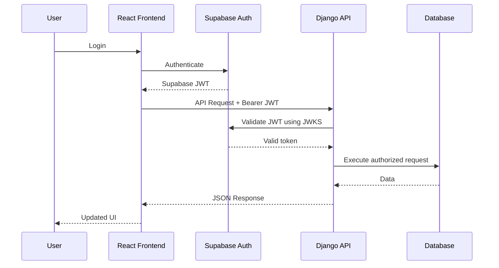
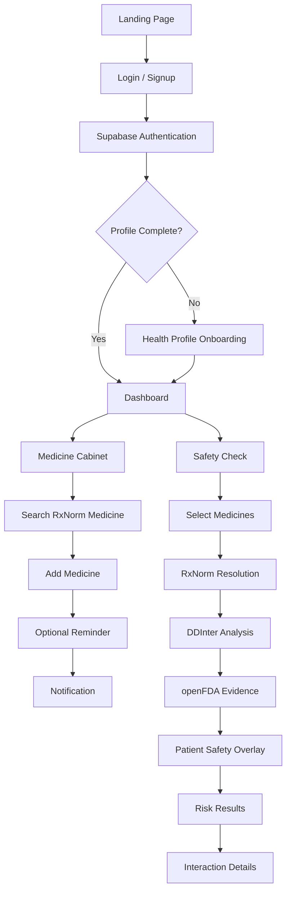

# 🛡️ MediGuard — Smart Medicine Safety & Drug Interaction Assistant

> **"Because no patient should get hurt by the medicine that was supposed to help them."**

MediGuard is a full-stack healthcare safety application designed to help patients, caregivers, and healthcare professionals identify potential medication risks before taking medicines together.

The platform combines **RxNorm medicine normalization**, the **DDInter 2.0 drug-drug interaction dataset**, **openFDA drug-label evidence**, and a **personalized patient safety engine** to provide understandable medication safety information.

---

## 📌 Project Information

| Field | Details |
|---|---|
| **Project Name** | MediGuard |
| **Event** | HackInMotion 2026 |
| **Team** | RICR |
| **Team ID** | `HIM-1084` |
| **Domain** | Healthcare & Patient Safety |
| **Application Type** | Full-Stack Web Application |

### 👥 Team

- **Anshika Khandelwal** — Team Leader
- **Divya**
- **Anshul Sharma**
- **Shivendra Chauhan**

---

# 🎯 Problem Statement

Patients frequently take multiple medicines simultaneously for conditions such as fever, diabetes, hypertension, allergies, infections, and chronic diseases.

However, medicines that are safe individually can sometimes produce harmful effects when taken together.

These **drug-drug interactions (DDIs)** can:

- Increase toxicity
- Reduce therapeutic effectiveness
- Increase bleeding or other adverse-event risks
- Worsen existing medical conditions
- Require dosage adjustments
- Lead to serious medical complications

The problem becomes more complex when a patient already has conditions such as asthma, hypertension, diabetes, or renal impairment.

MediGuard addresses this problem by providing a centralized medication safety layer that considers both:

1. **Drug-to-drug interactions**
2. **Patient-specific health conditions**

---

# 💡 Solution

MediGuard provides a medication safety workflow where users can:

1. Create an account and authenticate securely.
2. Complete their health profile.
3. Search medicines using canonical RxNorm data.
4. Maintain a personal medicine cabinet.
5. Add optional medication reminder times.
6. Select medicines for a safety check.
7. Detect potential drug-drug interactions.
8. View interaction severity.
9. Retrieve supporting drug-label evidence from openFDA.
10. Receive patient-specific warnings based on medical conditions.
11. View understandable explanations and recommended precautions.
12. Access medication safety information through an English/Hindi interface.

---

# 🏗️ System Architecture

flowchart TD

    User([👤 Patient / Caregiver / Pharmacist])

    User --> Frontend

    subgraph Frontend["React 19 + Vite Frontend"]
        UI[User Interface]
        Auth[Authentication Context]
        Lang[Language Context]
        Services[API Service Layer]
    end

    subgraph Backend["Django REST Framework Backend"]
        API[REST API]
        AuthAPI[Authentication]
        MedicineAPI[Medicine API]
        InteractionAPI[Interaction API]
        PatientAPI[Patient Safety API]
    end

    subgraph SafetyEngine["Medication Safety Engine"]
        RxNorm[RxNorm Normalization]
        DDInter[DDInter 2.0]
        FDA[openFDA Evidence]
        PatientSafety[Patient Safety Engine]
    end

    subgraph Database["Database"]
        PostgreSQL[(PostgreSQL / Supabase)]
        Medicines[(RxNorm Medicines)]
        Mappings[(DDInter Mappings)]
        Interactions[(Drug Interactions)]
        Profiles[(Patient Profiles)]
    end

    UI --> Auth
    UI --> Lang
    UI --> Services
    Services --> API

    API --> AuthAPI
    API --> MedicineAPI
    API --> InteractionAPI
    API --> PatientAPI

    MedicineAPI --> RxNorm
    InteractionAPI --> RxNorm
    RxNorm --> DDInter
    InteractionAPI --> FDA
    PatientAPI --> PatientSafety

    RxNorm --> Database
    DDInter --> Interactions
    PatientSafety --> Profiles

    Database --> PostgreSQL


Technology Stack
Frontend
Technology	Purpose
React 19	Component-based UI
Vite	Development server and production build
JavaScript ES6+	Application logic
Vanilla CSS3	Responsive styling and design system
Supabase JS	Authentication session management
Oxlint	Static analysis and linting
Web Notifications API	Browser medication notifications


Backend
Technology	Purpose
Django 6.1	Backend framework
Django REST Framework 3.18	REST API layer
PyJWT	JWT handling
cryptography	JWT cryptographic verification
PostgreSQL	Production database
SQLite	Local development database
psycopg	PostgreSQL driver
WhiteNoise	Static file serving
django-cors-headers	CORS configuration


Clinical Data Sources
Source	Role
DDInter 2.0	Primary drug-drug interaction source
RxNorm / NLM	Medicine normalization and canonical identification
openFDA	Supporting FDA drug-label evidence


🧠 Clinical Data & Interaction Architecture
MediGuard follows an offline-first interaction architecture.
Instead of relying entirely on an external API every time a user performs a safety check, the DDInter dataset is processed and loaded into the application's database.
This provides:
Fast interaction lookups
Reduced API dependency
No external latency for the primary DDI calculation
Reliable operation even when external evidence services are unavailable
Current Dataset
10,874 canonical drug-drug interaction pairs
1,405 DDInter-to-RxNorm mappings
1,400+ normalized medicines
🔬 Drug Interaction Pipeline

flowchart LR

    A[User Medicine Input]
    B[Input Cleanup]
    C[RxNorm Resolution]
    D[DDInter Pairwise Check]
    E[openFDA Evidence]
    F[Normalized Result]
    G[Patient Safety Overlay]

    A --> B
    B --> C
    C --> D
    D --> E
    E --> F
    F --> G
```


Step 1 — Input Cleanup
Medicine inputs are:
Trimmed
Deduplicated
Validated
Step 2 — RxNorm Resolution
Each medicine is resolved through multiple strategies:
RxCUI
  ↓
Database ID
  ↓
Exact medicine name
  ↓
Case-insensitive name
  ↓
DDInter alias
This allows inputs such as:
paracetamol
Paracetamol
PARACETAMOL
to resolve consistently to the same canonical medicine.
Step 3 — DDInter Interaction Check
For N medicines, MediGuard generates:
N(N-1)/2
unique medicine pairs.
For example:
3 medicines

A + B
A + C
B + C
The interaction engine performs optimized database queries to identify matching interaction records.
Step 4 — openFDA Evidence
After identifying the medicines, MediGuard optionally retrieves supporting FDA drug-label information such as:
Drug interactions
Warnings
Precautions
Adverse reactions
openFDA is used as a supporting evidence source, not as the primary interaction engine.
If openFDA is unavailable, the DDInter result remains available.
Step 5 — Patient Safety Overlay
The patient's health profile is evaluated against medication-specific safety rules.
For example:
Asthma + NSAID
        ↓
Potential bronchospasm warning
Hypertension + Decongestant
        ↓
Potential blood-pressure warning
Renal Impairment + NSAID
        ↓
Potential kidney-related warning

💊 Medicine Management
MediGuard provides a personal medication cabinet.
Users can:
Search medicines
Select canonical medicines
Add medicines to their cabinet
Remove medicines
Store medication information
Assign optional reminder times
Example:
💊 Paracetamol
⏰ 08:30 AM
Reminder scheduling is intentionally separated from clinical safety calculations.
Reminder schedules never influence DDI severity or clinical safety results.

⏰ Reminder & Notification System
The frontend provides an optional medication reminder workflow.
```mermaid
flowchart LR

    A[Add Medicine]
    B["+ Add Time"]
    C[Time Picker]
    D[Save Reminder]
    E[Medicine Badge]
    F[Notification Bell]
    G[Mark as Read]

    A --> B
    B --> C
    C --> D
    D --> E
    D --> F
    F --> G


Time Picker
Users can select:
Hour
Minute
AM / PM
Example:
08 : 30 AM
Notification Interface
The notification system provides:
Unread notification count
Notification cards
Medication reminder messages
Mark-as-read functionality
Mark-all-as-read functionality
Outside-click dismissal
🌐 Multi-Language Support
MediGuard supports:
🇬🇧 English
🇮🇳 Hindi
Localization is handled through a custom React LanguageContext.
The language switch applies throughout the application without requiring a page reload.
Translated areas include:
Navigation
Dashboard
Medicine cabinet
Safety check
Forms
Reminder controls
Notifications
Error messages
Safety indicators
👤 Patient Health Profile
During onboarding, users can provide:
Age
Medical conditions
Regular medicines
The profile is then used by the personalized safety engine.
Example:
{
  "age": 30,
  "medicalConditions": "Asthma, Hypertension",
  "regularMedicines": [
    "acetaminophen",
    "warfarin"
  ]
}
The system does not simply ask:
"Do these medicines interact?"

It can additionally evaluate:
"Could these medicines be problematic given this patient's existing conditions?"

🩺 Personalized Safety Engine
The PatientSafetyEngine combines:
Drug-Drug Interactions
          +
Patient Medical Conditions
          ↓
Personalized Safety Assessment
Example rules currently represented in the system:
Condition	Medication Category	Potential Warning
Asthma	NSAIDs	Possible bronchospasm risk
Renal Impairment	NSAIDs	Potential kidney injury risk
Renal Impairment	Metformin	Potential lactic-acidosis concern
Hypertension	Decongestants	Potential blood-pressure elevation
Diabetes	Beta-blockers	May mask hypoglycemia symptoms


These rules are intended as safety-screening assistance and are not a replacement for professional medical judgment.
📡 API Documentation
All APIs are implemented using Django REST Framework.
🔐 Authentication APIs
Method	Endpoint	Description	Authentication
POST	/api/auth/register/	Register user	Public
POST	/api/auth/login/	Authenticate user	Public
POST	/api/auth/refresh/	Refresh access token	Public
GET	/api/auth/me/	Get authenticated user	Required
POST	/api/auth/profile/onboarding/	Complete onboarding	Required


💊 Medicine APIs
Search Medicines
GET /api/medicines/?search=para
Searches across:
RxNorm medicine name
RxCUI
DDInter mapped names
The response is capped at the top 50 matches.
Example Response
{
  "success": true,
  "count": 1,
  "results": [
    {
      "id": 1,
      "rxcui": "161",
      "name": "acetaminophen",
      "rxnorm_name": "acetaminophen",
      "tty": "IN"
    }
  ]
}
Medicine by ID
GET /api/medicines/{id}/
Returns canonical medicine information.
Medicine by RxCUI
GET /api/medicines/rxcui/{rxcui}/
Returns medicine information using its RxNorm Concept Unique Identifier.
🔬 Drug Interaction APIs
Unified Interaction Check
POST /api/interactions/check/
Authentication
Authorization: Bearer <supabase_access_token>
Request
{
  "medicines": [
    "warfarin",
    "aspirin"
  ]
}
Processing
Input
 ↓
Validation
 ↓
RxNorm Resolution
 ↓
DDInter Check
 ↓
openFDA Evidence
 ↓
Normalized Response
Example Response
{
  "success": true,
  "has_interactions": true,
  "summary": {
    "total_checked": 2,
    "pairs_checked": 1,
    "interactions_found": 1,
    "major": 1,
    "moderate": 0,
    "minor": 0
  },
  "interactions": [
    {
      "medicine_a": {
        "name": "warfarin"
      },
      "medicine_b": {
        "name": "aspirin"
      },
      "severity": "Major",
      "level": "Major",
      "description": "Potential major interaction identified between warfarin and aspirin."
    }
  ]
}
🧾 openFDA Drug Label API
GET /api/interactions/openfda/?drug=warfarin
Returns supporting FDA drug-label information.
Possible information includes:
Drug interactions
Warnings
Precautions
Adverse reactions
Generic name
Brand name
RxCUI
If openFDA cannot be reached, the primary DDInter result is not discarded.
🤖 AI Interaction Explanation API
POST /api/interactions/explain/
Request
{
  "drug_a": "warfarin",
  "drug_b": "aspirin",
  "severity": "Major"
}
Response
{
  "success": true,
  "drug_a": "warfarin",
  "drug_b": "aspirin",
  "severity": "Major",
  "ai_explanation": {
    "what_does_this_mean": "...",
    "what_to_watch_for": "...",
    "what_should_you_do": "...",
    "disclaimer": "..."
  }
}
The AI layer is used to transform technical interaction information into more understandable safety guidance.
👤 Patient Profile APIs
Method	Endpoint	Description
GET	/api/profile/	Retrieve health profile
POST	/api/profile/	Create/update profile
PATCH	/api/profile/	Partially update profile


Profile ownership is determined from the authenticated Supabase identity.
User IDs are not accepted from request bodies, reducing the risk of unauthorized profile access.
🛡️ Personalized Safety Check
POST /api/patients/safety-check/
Request
{
  "medicines": [
    "acetaminophen",
    "warfarin",
    "aspirin"
  ],
  "medicalConditions": "Asthma"
}
Processing
Medicines
    ↓
Pairwise DDI Detection
    +
Medical Condition Evaluation
    ↓
Personalized Safety Result
Response Structure
{
  "success": true,
  "has_warnings": true,
  "drug_interactions": {},
  "patient_condition_warnings": [],
  "summary": {
    "total_medicines_checked": 3,
    "drug_interactions_count": 1,
    "condition_warnings_count": 1,
    "major_warnings": 0,
    "moderate_warnings": 2
  }
}
📊 Dashboard API
GET /api/dashboard/overview/
Provides:
Active medicine count
Current safety status
Major warning count
Moderate warning count
Regular medicines
Medical conditions
Example:
{
  "success": true,
  "safety_overview": {
    "title": "Safety Overview",
    "mainValue": "1 Active Warning",
    "supportingText": "Potential medication interactions need your attention.",
    "hasWarnings": true,
    "majorCount": 0,
    "moderateCount": 1
  },
  "active_medicines_count": 2
}
🗄️ Database Schema
```mermaid
erDiagram

    User ||--o| UserProfile : has

    Medicine ||--o{ DDInterDrugMapping : mapped_by

    Medicine ||--o{ DrugInteraction : participates_in

    User {
        int id PK
        string username
        string email
        string password
        datetime date_joined
    }

    UserProfile {
        int id PK
        int user_id FK
        int age
        string medical_conditions
        json regular_medicines
        boolean profile_completed
    }

    Medicine {
        int id PK
        string name
        string rxnorm_name
        string rxcui
        string tty
    }

    DDInterDrugMapping {
        int id PK
        int medicine_id FK
        string ddinter_drug_name
    }

    DrugInteraction {
        int id PK
        string drug_a
        string drug_b
        string severity
        string description
    }
```


🔐 Authentication Architecture
MediGuard uses Supabase Auth on the frontend and Django as the backend security boundary.



Protected endpoints use:
Authorization: Bearer <supabase_access_token>
Django verifies the token using Supabase's JWKS infrastructure.
🔒 Security
MediGuard implements several security measures:
Authentication
Supabase JWT authentication
Backend token verification
Protected API endpoints
User-scoped profile access
Backend Security
CORS configuration
Secure HTTP response headers
X-Frame-Options: DENY
Content-type sniffing protection
Environment-based secrets
Production static-file handling through WhiteNoise
API Security
Authentication on sensitive endpoints
Request validation using DRF serializers
User identity derived from verified JWT
No user IDs accepted for profile ownership
External API keys never exposed to frontend responses
🖥️ Frontend Architecture

flowchart TD

    App[App.jsx]

    App --> Auth[AuthContext]
    App --> Lang[LanguageContext]

    App --> Pages

    Pages --> Dashboard
    Pages --> Medicines
    Pages --> Safety
    Pages --> Profile
    Pages --> History

    Dashboard --> Components
    Medicines --> Components
    Safety --> Components

    Components --> Services

    Services --> APIClient

    APIClient --> Django[Django REST API]


📁 Frontend Structure
frontend/
├── public/
├── src/
│   ├── assets/
│   ├── components/
│   │   ├── auth/
│   │   ├── common/
│   │   ├── dashboard/
│   │   ├── history/
│   │   ├── interactions/
│   │   └── medicines/
│   ├── context/
│   │   ├── AuthContext.jsx
│   │   └── LanguageContext.jsx
│   ├── hooks/
│   ├── pages/
│   │   ├── Dashboard/
│   │   ├── History/
│   │   ├── Landing/
│   │   ├── Login/
│   │   ├── Medicines/
│   │   ├── Profile/
│   │   ├── SafetyCheck/
│   │   ├── Settings/
│   │   └── Signup/
│   ├── services/
│   │   ├── api/
│   │   ├── auth/
│   │   ├── history/
│   │   ├── interactions/
│   │   ├── medicines/
│   │   └── profile/
│   ├── styles/
│   ├── utils/
│   ├── App.jsx
│   ├── App.css
│   └── main.jsx
├── package.json
├── vite.config.js
└── vercel.json
📁 Backend Structure
backend/
├── apps/
│   ├── authentication/
│   │   ├── models.py
│   │   ├── serializers.py
│   │   ├── urls.py
│   │   └── views.py
│   │
│   ├── interactions/
│   │   ├── models.py
│   │   ├── serializers.py
│   │   ├── services.py
│   │   ├── urls.py
│   │   └── views.py
│   │
│   ├── medicines/
│   │   ├── models.py
│   │   ├── serializers.py
│   │   ├── urls.py
│   │   └── views.py
│   │
│   └── patients/
│       ├── serializers.py
│       ├── services.py
│       ├── urls.py
│       └── views.py
│
├── config/
│   ├── settings.py
│   ├── urls.py
│   ├── asgi.py
│   └── wsgi.py
│
├── data/
├── Dockerfile
├── Procfile
├── requirements.txt
└── manage.py
🔄 Complete User Workflow



🎨 UI/UX Design
MediGuard follows a clean healthcare-focused visual system.
Primary Design Language
Primary Accent:     #A63D35
Card Surface:       #FFFDFC
Border:             #E9DDD9
Typography:         #24201F
The interface emphasizes:
Clear severity indicators
Minimal cognitive load
Large readable safety messages
Responsive layouts
Consistent cards and controls
Accessible interaction states
Patient-friendly terminology


📱 Responsive Design
The frontend supports:
Desktop
> 1024px
Persistent sidebar
Multi-column dashboard
Expanded safety cards
Notification dropdown
Tablet
768px – 1024px
Adaptive cards
Responsive navigation
Flexible modal sizing
Mobile
< 768px
Collapsible navigation
Stacked layouts
Full-width safety cards
Mobile-friendly time picker
Constrained notification panel
>
> 
🧪 Development & Quality
The frontend uses Oxlint for static analysis.
Development checks
npm run lint
Production build
npm run build
The frontend production build has been verified successfully with Vite.
💻 Local Development
Prerequisites
Python 3.11+
Node.js 18+
npm
Git
1. Clone Repository
git clone https://github.com/Anshikakhandelwall/HackInMotion-RICR-HIM-1084.git

cd HackInMotion-RICR-HIM-1084
Backend Setup
cd backend

python -m venv venv
Windows
venv\Scripts\activate
Linux / macOS
source venv/bin/activate
Install dependencies:
pip install -r requirements.txt
Run migrations:
python manage.py migrate
Start backend:
python manage.py runserver 0.0.0.0:8000
Backend:
http://localhost:8000
Frontend Setup
Open another terminal:
cd frontend

npm install

npm run dev
Frontend:
http://localhost:5173

🔑 Environment Variables
Backend
Create:
backend/.env
Example:
DB_NAME=
DB_USER=
DB_PASSWORD=
DB_HOST=
DB_PORT=5432


OPENFDA_API_KEY=<your-openfda-api-key>
Important
Never expose:
OPENFDA_API_KEY
to the frontend.
Frontend
Create:
frontend/.env.local
Never place the Supabase service-role key in frontend environment variables.


🐳 Deployment
MediGuard can be deployed using Docker-compatible platforms such as:
Render
Railway
Other containerized hosting environments
Docker
docker build -t mediguard-backend .
Run:
docker run -p 8000:8000 \
  -e DJANGO_SECRET_KEY="your-secret-key" \
  mediguard-backend
Production Process
Frontend
   ↓
Vercel

Backend
   ↓
Render / Railway

Database
   ↓
Supabase PostgreSQL


🧩 Key Design Decisions
1. Offline-First DDI Engine
DDInter data is stored locally rather than queried from an external service for every safety check.
Benefit:
Lower latency
+
No runtime DDI API dependency
+
Predictable availability
2. RxNorm Normalization
Medicine inputs are normalized before interaction analysis.
This prevents variations in naming from producing inconsistent results.
User Input
    ↓
RxNorm
    ↓
Canonical Medicine
    ↓
DDInter
3. openFDA as Supporting Evidence
DDInter determines the primary interaction result.
openFDA enriches that result with official drug-label information.
DDInter
   ↓
Interaction Severity
   +
openFDA
   ↓
Supporting Evidence
If openFDA is unavailable:
DDInter result
       ↓
Still returned
4. Patient-Specific Safety
The application does not stop at generic drug interactions.
It additionally considers known patient conditions.
Medication Data
      +
Patient Profile
      ↓
Personalized Safety Assessment
5. Reminder/Safety Separation
Medication reminders and clinical safety calculations are independent systems.
                 Medicine
                    |
          ┌─────────┴─────────┐
          ↓                   ↓
   Reminder Pipeline     Safety Pipeline
          ↓                   ↓
     Notifications       RxNorm + DDI
                              ↓
                       Clinical Results
A reminder time such as 08:30 AM cannot modify interaction severity or safety calculations.

📊 Feature Overview
Feature	Status
User Authentication	✅
Supabase JWT Verification	✅
Patient Health Profile	✅
RxNorm Medicine Search	✅
Medicine Cabinet	✅
DDInter 2.0 Integration	✅
DDInter → RxNorm Mapping	✅
Drug Interaction Detection	✅
Severity Classification	✅
openFDA Supporting Evidence	✅
Personalized Condition Warnings	✅
Safety Dashboard	✅
Medication Reminders	✅
Notification Bell	✅
English / Hindi UI	✅
Responsive UI	✅
AI Interaction Explanation	✅


🚀 Future Scope
Prescription OCR
Upload a prescription image and automatically extract medicine names.
Doctor / Pharmacist Mode
Provide a more detailed clinical interface with:
Interaction mechanisms
Clinical references
Detailed severity information
Professional-oriented views
Allergy Cross-Check
Compare medicines against known patient allergies.
DailyMed Integration
Add DailyMed as an additional drug-label evidence source.
Advanced AI Explanations
Generate more contextual explanations while maintaining clear safety boundaries.
Interaction History
Persist every safety check for longitudinal medication-safety tracking.

⚠️ Medical Disclaimer
MediGuard is an educational and informational medication-safety tool developed for hackathon purposes.
It is not a substitute for professional medical advice, diagnosis, or treatment.
Interaction results should not be used to independently start, stop, or modify medication.
Users should always consult a qualified healthcare professional or pharmacist before making medication-related decisions.

project live link :
https://hack-in-motion-ricr-him-1084.vercel.app/

❤️ Built For
HackInMotion 2026
Team RICR — HIM-1084
MediGuard — making medication safety easier to understand, one interaction at a time.
