# 🛡️ MediGuard — Smart Medicine Safety & Drug Interaction Assistant

> **"Because no patient should get hurt by the medicine that was supposed to help them."**

MediGuard is a full-stack healthcare safety application designed to help **patients, caregivers, and healthcare professionals** identify potential medication risks before medicines are taken together.

The platform combines:

- **RxNorm** for medicine normalization and canonical identification
- **DDInter 2.0** for drug-drug interaction detection
- **openFDA** for supporting drug-label evidence
- **Patient Safety Engine** for condition-specific medication warnings
- **Supabase Auth** for secure authentication
- **Django REST Framework** for backend APIs
- **PostgreSQL / Supabase** for persistent application data

MediGuard is designed around one principle:

> **Don't just ask whether two medicines interact. Ask whether they are safe for this particular patient.**

---

## 📌 Project Information

| Field | Details |
|---|---|
| **Project Name** | MediGuard |
| **Event** | HackInMotion 2026 |
| **Team** | RICR |
| **Team ID** | `HIM-1084` |
| **Domain** | Healthcare & Patient Safety |
| **Application Type** | Full-Stack Web Application |
| **Frontend** | React 19 + Vite |
| **Backend** | Django 6.1 + Django REST Framework |
| **Database** | PostgreSQL / Supabase |
| **Authentication** | Supabase Auth |
| **Primary DDI Source** | DDInter 2.0 |
| **Medicine Normalization** | RxNorm |
| **Supporting Evidence** | openFDA |

---

## 👥 Team

- **Anshika Khandelwal** — Team Leader
- **Divya**
- **Anshul Sharma**
- **Shivendra Chauhan**

---

# 🎯 Problem Statement

Patients frequently take multiple medicines simultaneously for conditions such as:

- Fever
- Diabetes
- Hypertension
- Allergies
- Infections
- Asthma
- Chronic diseases

Medicines that are safe individually can sometimes produce harmful effects when taken together.

Drug-drug interactions can:

- Increase toxicity
- Reduce therapeutic effectiveness
- Increase bleeding or other adverse-event risks
- Worsen existing medical conditions
- Require dosage adjustments
- Lead to serious medical complications

The problem becomes even more complex when the patient already has conditions such as:

- Asthma
- Hypertension
- Diabetes
- Renal impairment

Most basic interaction checkers focus primarily on:

> **Drug A + Drug B → Interaction**

MediGuard extends this approach to:

> **Medicines + Patient Health Profile → Personalized Safety Assessment**

---

# 💡 Solution

MediGuard provides a centralized medication-safety workflow where users can:

1. Create an account and authenticate securely.
2. Complete their health profile.
3. Search medicines using canonical RxNorm data.
4. Maintain a personal medicine cabinet.
5. Add optional medication reminder times.
6. Select medicines for a safety check.
7. Detect potential drug-drug interactions.
8. View interaction severity.
9. Retrieve supporting drug-label evidence from openFDA.
10. Receive patient-specific warnings based on medical conditions.
11. Get understandable AI-assisted explanations.
12. Access the application in English or Hindi.

---

# 🏗️ High-Level System Architecture

MediGuard follows a layered architecture separating the frontend, backend API layer, medication safety engine, external clinical data sources, and persistent database.

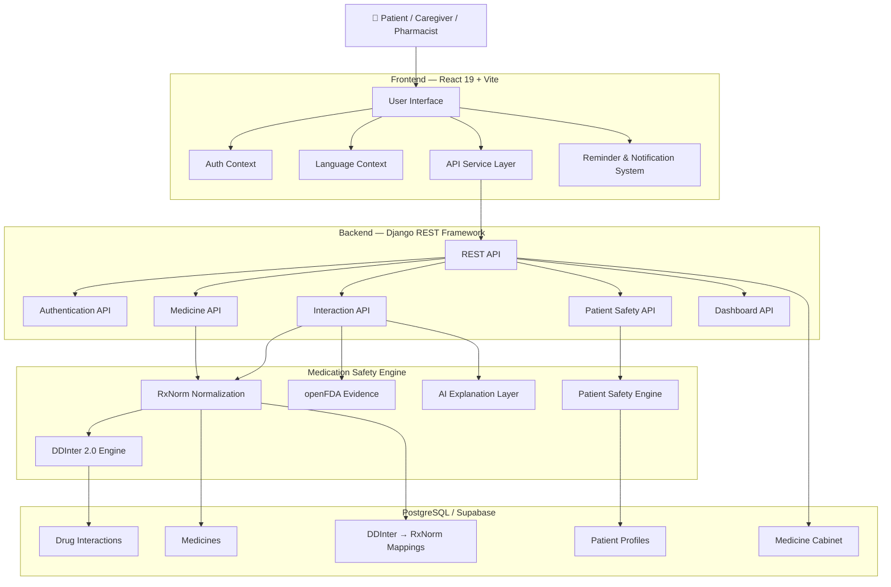

### Architecture Layers

| Layer | Responsibility |
|---|---|
| **Frontend** | User interface, authentication state, localization, medicine management and reminders |
| **Django API** | Business logic, validation, authorization and API endpoints |
| **Safety Engine** | RxNorm normalization, DDI analysis and patient-specific safety rules |
| **Clinical Data Sources** | DDInter, RxNorm and openFDA |
| **Database** | Medicines, mappings, interactions, profiles and medication data |
| **AI Layer** | Converts technical interaction information into understandable explanations |

---

# 🧠 Clinical Data Architecture

MediGuard uses a hybrid **offline-first + external-evidence** architecture.

The primary DDInter interaction dataset is processed and stored locally in the application's database.

This means the core interaction check does **not** depend on an external API being available at runtime.

### Why this approach?

- Faster interaction lookups
- Reduced external API dependency
- Predictable availability
- Lower runtime latency
- Primary DDI detection remains available even if openFDA is unavailable

### Clinical Data Sources

| Source | Role |
|---|---|
| **DDInter 2.0** | Primary drug-drug interaction dataset |
| **RxNorm / NLM** | Medicine normalization and canonical identification |
| **openFDA** | Supporting FDA drug-label evidence |

---

# 📊 Current Clinical Dataset

MediGuard currently contains:

| Dataset Component | Count |
|---|---:|
| Canonical drug-drug interaction pairs | **10,874** |
| DDInter → RxNorm mappings | **1,405** |
| Normalized medicines | **1,400+** |

---

# 🔬 Drug Interaction Pipeline

The core medication safety pipeline consists of five stages.

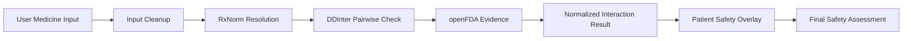

## Step 1 — Input Cleanup

Medicine inputs are:

- Trimmed
- Deduplicated
- Validated

---

## Step 2 — RxNorm Resolution

Each medicine is resolved through multiple strategies:

```text
User Input
    ↓
RxCUI
    ↓
Database ID
    ↓
Exact Medicine Name
    ↓
Case-Insensitive Name
    ↓
DDInter Alias
    ↓
Canonical Medicine
```

This allows inputs such as:

```text
paracetamol
Paracetamol
PARACETAMOL
```

to resolve consistently to the same canonical medicine.

---

## Step 3 — DDInter Interaction Check

For `N` medicines, MediGuard generates:

```text
N(N - 1) / 2
```

unique medicine pairs.

For example, with three medicines:

```text
Medicine A + Medicine B
Medicine A + Medicine C
Medicine B + Medicine C
```

The interaction engine performs optimized database queries against the locally stored DDInter interaction records.

---

## Step 4 — openFDA Evidence

After identifying medicines and potential interactions, MediGuard can retrieve supporting drug-label information from openFDA.

Possible information includes:

- Drug interactions
- Warnings
- Precautions
- Adverse reactions
- Generic name
- Brand name

openFDA is used as a **supporting evidence source**, not as the primary DDI engine.

If openFDA is unavailable:

```text
DDInter Result
      ↓
Still Returned
```

The primary safety result is therefore not discarded.

---

## Step 5 — Patient Safety Overlay

The patient's health profile is evaluated against medication-specific safety rules.

Example:

```text
Asthma + NSAID
        ↓
Potential bronchospasm warning
```

```text
Hypertension + Decongestant
        ↓
Potential blood-pressure warning
```

```text
Renal Impairment + NSAID
        ↓
Potential kidney-related warning
```

---

# 🩺 Personalized Safety Engine

The personalized safety engine combines two independent safety dimensions:

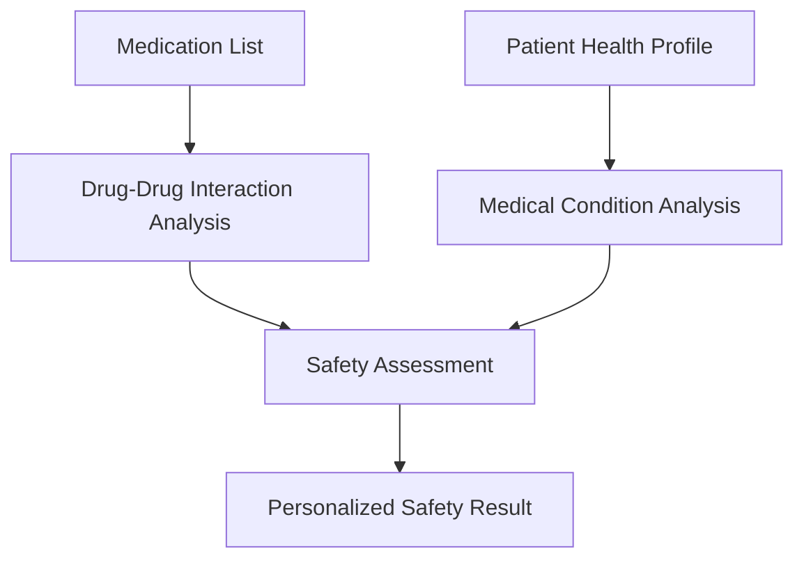

Instead of asking only:

> **"Do these medicines interact?"**

MediGuard can additionally evaluate:

> **"Could these medicines be problematic given this patient's existing medical conditions?"**

---

## Current Safety Rules

| Patient Condition | Medication Category | Potential Warning |
|---|---|---|
| Asthma | NSAIDs | Possible bronchospasm risk |
| Renal Impairment | NSAIDs | Potential kidney injury risk |
| Renal Impairment | Metformin | Potential lactic-acidosis concern |
| Hypertension | Decongestants | Potential blood-pressure elevation |
| Diabetes | Beta-blockers | May mask hypoglycemia symptoms |

These rules are intended for **safety screening assistance** and are not a replacement for professional medical judgment.

---

# 💊 Medicine Management

MediGuard provides a personal medication cabinet.

Users can:

- Search medicines
- Select canonical medicines
- Add medicines to their cabinet
- Remove medicines
- Store medication information
- Assign optional reminder times

Example:

```text
💊 Paracetamol

⏰ 08:30 AM
```

Reminder scheduling is intentionally separated from clinical safety calculations.

A reminder time such as `08:30 AM` cannot modify:

- DDI severity
- Interaction detection
- Patient safety rules
- Clinical safety results

---

# ⏰ Reminder & Notification Architecture

The reminder system is independent of the clinical safety pipeline.

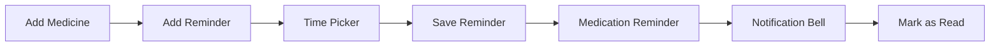

### Time Picker

Users can select:

- Hour
- Minute
- AM / PM

Example:

```text
08 : 30 AM
```

### Notification Interface

The notification system provides:

- Unread notification count
- Notification cards
- Medication reminder messages
- Mark-as-read functionality
- Mark-all-as-read functionality
- Outside-click dismissal

---

# 🌐 Multi-Language Support

MediGuard currently supports:

- 🇬🇧 English
- 🇮🇳 Hindi

Localization is implemented through a custom React `LanguageContext`.

The language switch applies throughout the application without requiring a page reload.

Translated areas include:

- Navigation
- Dashboard
- Medicine cabinet
- Safety check
- Forms
- Reminder controls
- Notifications
- Error messages
- Safety indicators

---

# 👤 Patient Health Profile

During onboarding, users can provide:

- Age
- Medical conditions
- Regular medicines

Example:

```json
{
  "age": 30,
  "medicalConditions": "Asthma, Hypertension",
  "regularMedicines": [
    "acetaminophen",
    "warfarin"
  ]
}
```

The profile is used by the personalized safety engine when evaluating medicines.

---

# 🔐 Authentication Architecture

MediGuard uses **Supabase Auth on the frontend** while Django acts as the backend security boundary.

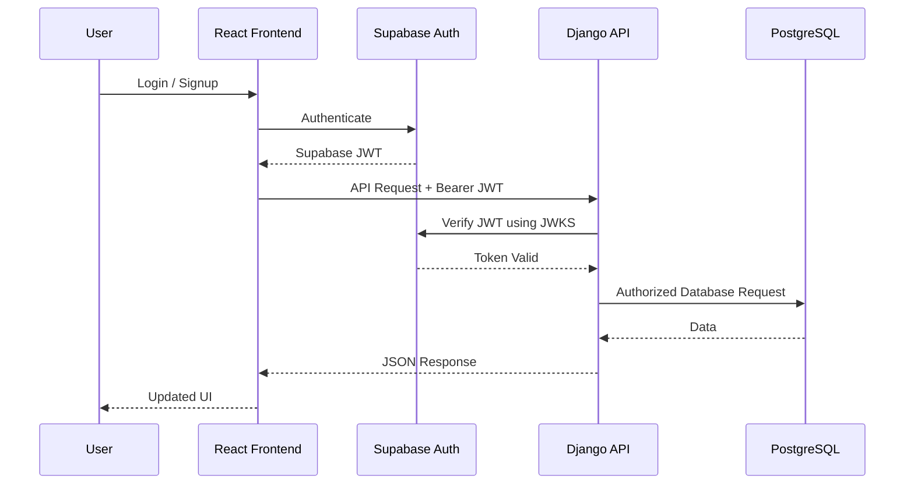

Protected requests use:

```http
Authorization: Bearer <supabase_access_token>
```

Django verifies the token using Supabase's JWKS infrastructure.

---

# 🔒 Security

MediGuard implements multiple security measures.

### Authentication

- Supabase JWT authentication
- Backend token verification
- Protected API endpoints
- User-scoped profile access

### Backend Security

- CORS configuration
- Secure HTTP response headers
- `X-Frame-Options: DENY`
- Content-type sniffing protection
- Environment-based secrets
- WhiteNoise for production static files

### API Security

- Authentication on sensitive endpoints
- DRF serializer validation
- User identity derived from verified JWT
- No user IDs accepted for profile ownership
- External API keys never exposed to frontend responses

---

# 🗄️ Database Architecture

The database stores the application's normalized medicine data, DDI mappings, interaction records, patient profiles and medication information.

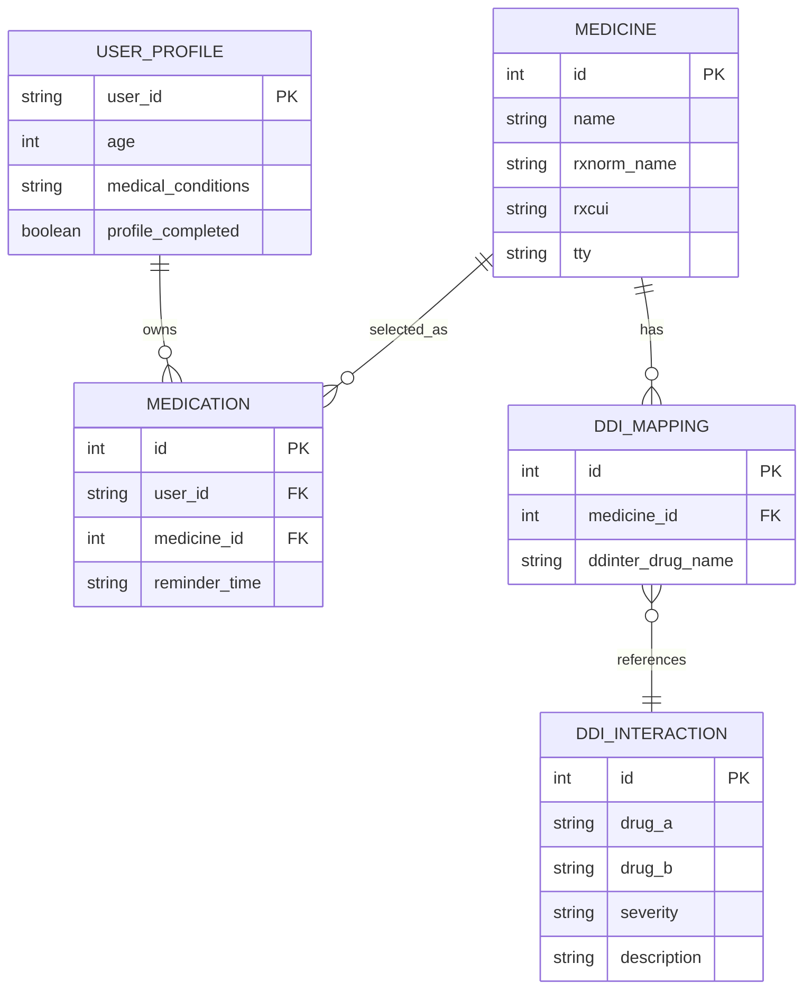

> **Note:** Authentication identity is handled by Supabase Auth. The application associates the authenticated Supabase identity with the user's profile and application data.

---

# 📡 API Architecture

All backend APIs are implemented using Django REST Framework.

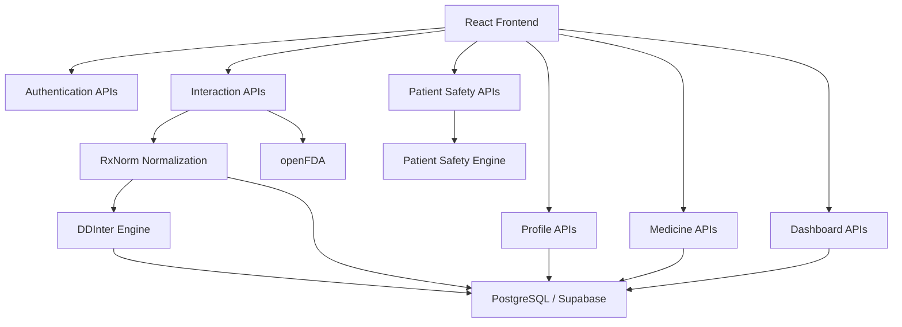

---

# 🔐 Authentication APIs

| Method | Endpoint | Description | Authentication |
|---|---|---|---|
| `POST` | `/api/auth/register/` | Register user | Public |
| `POST` | `/api/auth/login/` | Authenticate user | Public |
| `POST` | `/api/auth/refresh/` | Refresh access token | Public |
| `GET` | `/api/auth/me/` | Get authenticated user | Required |
| `POST` | `/api/auth/profile/onboarding/` | Complete onboarding | Required |

---

# 💊 Medicine APIs

### Search Medicines

```http
GET /api/medicines/?search=para
```

Searches across:

- RxNorm medicine name
- RxCUI
- DDInter mapped names

The response is capped at the top 50 matches.

### Example Response

```json
{
  "success": true,
  "count": 1,
  "results": [
    {
      "id": 1,
      "rxcui": "161",
      "name": "acetaminophen",
      "rxnorm_name": "acetaminophen",
      "tty": "IN"
    }
  ]
}
```

### Medicine by ID

```http
GET /api/medicines/{id}/
```

Returns canonical medicine information.

### Medicine by RxCUI

```http
GET /api/medicines/rxcui/{rxcui}/
```

Returns medicine information using its RxNorm Concept Unique Identifier.

---

# 🔬 Drug Interaction APIs

## Unified Interaction Check

```http
POST /api/interactions/check/
```

### Authentication

```http
Authorization: Bearer <supabase_access_token>
```

### Request

```json
{
  "medicines": [
    "warfarin",
    "aspirin"
  ]
}
```

### Processing Pipeline

```text
Input
  ↓
Validation
  ↓
RxNorm Resolution
  ↓
DDInter Check
  ↓
openFDA Evidence
  ↓
Normalized Response
```

### Example Response

```json
{
  "success": true,
  "has_interactions": true,
  "summary": {
    "total_checked": 2,
    "pairs_checked": 1,
    "interactions_found": 1,
    "major": 1,
    "moderate": 0,
    "minor": 0
  },
  "interactions": [
    {
      "medicine_a": {
        "name": "warfarin"
      },
      "medicine_b": {
        "name": "aspirin"
      },
      "severity": "Major",
      "level": "Major",
      "description": "Potential major interaction identified between warfarin and aspirin."
    }
  ]
}
```

---

# 🧾 openFDA Drug Label API

```http
GET /api/interactions/openfda/?drug=warfarin
```

Returns supporting FDA drug-label information.

Possible information includes:

- Drug interactions
- Warnings
- Precautions
- Adverse reactions
- Generic name
- Brand name
- RxCUI

If openFDA cannot be reached, the primary DDInter result remains available.

---

# 🤖 AI Interaction Explanation API

```http
POST /api/interactions/explain/
```

### Request

```json
{
  "drug_a": "warfarin",
  "drug_b": "aspirin",
  "severity": "Major"
}
```

### Response

```json
{
  "success": true,
  "drug_a": "warfarin",
  "drug_b": "aspirin",
  "severity": "Major",
  "ai_explanation": {
    "what_does_this_mean": "...",
    "what_to_watch_for": "...",
    "what_should_you_do": "...",
    "disclaimer": "..."
  }
}
```

The AI layer is used to transform technical interaction information into more understandable safety guidance.

---

# 👤 Patient Profile APIs

| Method | Endpoint | Description |
|---|---|---|
| `GET` | `/api/profile/` | Retrieve health profile |
| `POST` | `/api/profile/` | Create/update profile |
| `PATCH` | `/api/profile/` | Partially update profile |

Profile ownership is determined from the authenticated Supabase identity.

User IDs are not accepted from request bodies for profile ownership.

---

# 🛡️ Personalized Safety Check

```http
POST /api/patients/safety-check/
```

### Request

```json
{
  "medicines": [
    "acetaminophen",
    "warfarin",
    "aspirin"
  ],
  "medicalConditions": "Asthma"
}
```

### Processing

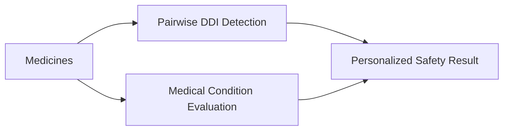

### Response Structure

```json
{
  "success": true,
  "has_warnings": true,
  "drug_interactions": {},
  "patient_condition_warnings": [],
  "summary": {
    "total_medicines_checked": 3,
    "drug_interactions_count": 1,
    "condition_warnings_count": 1,
    "major_warnings": 0,
    "moderate_warnings": 2
  }
}
```

---

# 📊 Dashboard API

```http
GET /api/dashboard/overview/
```

Provides:

- Active medicine count
- Current safety status
- Major warning count
- Moderate warning count
- Regular medicines
- Medical conditions

### Example

```json
{
  "success": true,
  "safety_overview": {
    "title": "Safety Overview",
    "mainValue": "1 Active Warning",
    "supportingText": "Potential medication interactions need your attention.",
    "hasWarnings": true,
    "majorCount": 0,
    "moderateCount": 1
  },
  "active_medicines_count": 2
}
```

---

# 🖥️ Frontend Architecture

The frontend follows a component-based architecture using React.

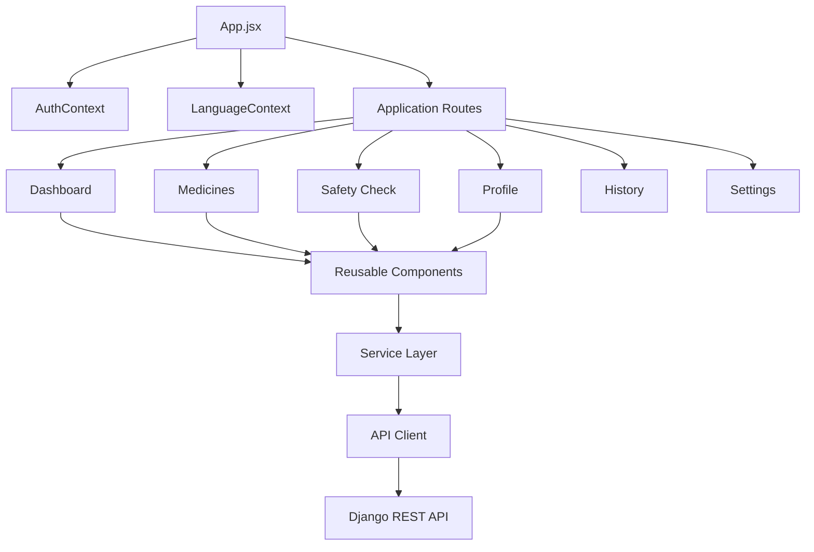

---

# 📁 Frontend Structure

```text
frontend/
├── public/
├── src/
│   ├── assets/
│   ├── components/
│   │   ├── auth/
│   │   ├── common/
│   │   ├── dashboard/
│   │   ├── history/
│   │   ├── interactions/
│   │   └── medicines/
│   │
│   ├── context/
│   │   ├── AuthContext.jsx
│   │   └── LanguageContext.jsx
│   │
│   ├── hooks/
│   │
│   ├── pages/
│   │   ├── Dashboard/
│   │   ├── History/
│   │   ├── Landing/
│   │   ├── Login/
│   │   ├── Medicines/
│   │   ├── Profile/
│   │   ├── SafetyCheck/
│   │   ├── Settings/
│   │   └── Signup/
│   │
│   ├── services/
│   │   ├── api/
│   │   ├── auth/
│   │   ├── history/
│   │   ├── interactions/
│   │   ├── medicines/
│   │   └── profile/
│   │
│   ├── styles/
│   ├── utils/
│   ├── App.jsx
│   ├── App.css
│   └── main.jsx
│
├── package.json
├── vite.config.js
└── vercel.json
```

---

# 🐍 Backend Architecture

The Django backend is divided into independent application modules.

```text
backend/
├── apps/
│   ├── authentication/
│   │   ├── models.py
│   │   ├── serializers.py
│   │   ├── urls.py
│   │   └── views.py
│   │
│   ├── interactions/
│   │   ├── models.py
│   │   ├── serializers.py
│   │   ├── services.py
│   │   ├── urls.py
│   │   └── views.py
│   │
│   ├── medicines/
│   │   ├── models.py
│   │   ├── serializers.py
│   │   ├── urls.py
│   │   └── views.py
│   │
│   └── patients/
│       ├── serializers.py
│       ├── services.py
│       ├── urls.py
│       └── views.py
│
├── config/
│   ├── settings.py
│   ├── urls.py
│   ├── asgi.py
│   └── wsgi.py
│
├── data/
├── Dockerfile
├── Procfile
├── requirements.txt
└── manage.py
```

---

# 🔄 Complete User Workflow

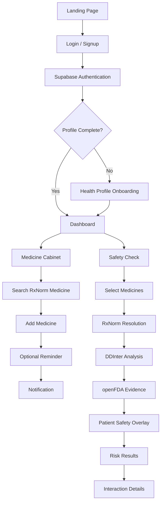

---

# 🎨 UI/UX Design

MediGuard follows a clean healthcare-focused visual system.

| Design Element | Value |
|---|---|
| **Primary Accent** | `#A63D35` |
| **Card Surface** | `#FFFDFC` |
| **Border** | `#E9DDD9` |
| **Typography** | `#24201F` |

The interface emphasizes:

- Clear severity indicators
- Minimal cognitive load
- Large readable safety messages
- Responsive layouts
- Consistent cards and controls
- Accessible interaction states
- Patient-friendly terminology

---

# 📱 Responsive Design

### Desktop — `> 1024px`

- Persistent sidebar
- Multi-column dashboard
- Expanded safety cards
- Notification dropdown

### Tablet — `768px–1024px`

- Adaptive cards
- Responsive navigation
- Flexible modal sizing

### Mobile — `< 768px`

- Collapsible navigation
- Stacked layouts
- Full-width safety cards
- Mobile-friendly time picker
- Constrained notification panel

---

# 🧪 Development & Quality

The frontend uses **Oxlint** for static analysis.

### Lint

```bash
npm run lint
```

### Production Build

```bash
npm run build
```

The frontend production build has been verified successfully with Vite.

---

# 🛠️ Technology Stack

## Frontend

| Technology | Purpose |
|---|---|
| React 19 | Component-based UI |
| Vite | Development server and production build |
| JavaScript ES6+ | Application logic |
| Vanilla CSS3 | Responsive styling and design system |
| Supabase JS | Authentication session management |
| Oxlint | Static analysis and linting |
| Web Notifications API | Browser medication notifications |

## Backend

| Technology | Purpose |
|---|---|
| Django 6.1 | Backend framework |
| Django REST Framework 3.18 | REST API layer |
| PyJWT | JWT handling |
| cryptography | JWT cryptographic verification |
| PostgreSQL | Production database |
| SQLite | Local development database |
| psycopg | PostgreSQL driver |
| WhiteNoise | Static file serving |
| django-cors-headers | CORS configuration |

## Clinical Data

| Source | Purpose |
|---|---|
| DDInter 2.0 | Primary DDI source |
| RxNorm / NLM | Medicine normalization |
| openFDA | Supporting drug-label evidence |

---

# 💻 Local Development

## Prerequisites

- Python 3.11+
- Node.js 18+
- npm
- Git

---

## 1. Clone Repository

```bash
git clone https://github.com/Anshikakhandelwall/HackInMotion-RICR-HIM-1084.git

cd HackInMotion-RICR-HIM-1084
```

---

## 2. Backend Setup

```bash
cd backend
```

### Create virtual environment

#### Windows

```bash
python -m venv venv
venv\Scripts\activate
```

#### Linux / macOS

```bash
python -m venv venv
source venv/bin/activate
```

### Install dependencies

```bash
pip install -r requirements.txt
```

### Run migrations

```bash
python manage.py migrate
```

### Start backend

```bash
python manage.py runserver 0.0.0.0:8000
```

Backend:

```text
http://localhost:8000
```

---

## 3. Frontend Setup

Open another terminal:

```bash
cd frontend
```

Install dependencies:

```bash
npm install
```

Start development server:

```bash
npm run dev
```

Frontend:

```text
http://localhost:5173
```

---

# 🔑 Environment Variables

## Backend

Create:

```text
backend/.env
```

Example:

```env
DB_NAME=
DB_USER=
DB_PASSWORD=
DB_HOST=
DB_PORT=5432

OPENFDA_API_KEY=
DJANGO_SECRET_KEY=
```

### Security

Never expose:

```text
OPENFDA_API_KEY
DJANGO_SECRET_KEY
```

to the frontend.

---

## Frontend

Create:

```text
frontend/.env.local
```

Never place the **Supabase service-role key** in frontend environment variables.

Only use public/client-side Supabase configuration in the frontend.

---

# 🐳 Deployment Architecture

MediGuard separates frontend hosting, backend hosting and database infrastructure.

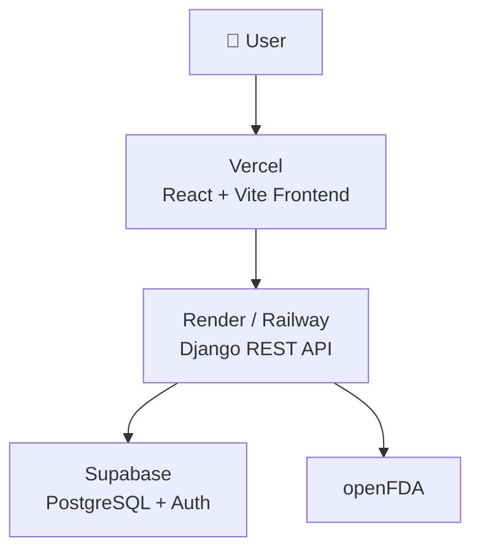

### Production Stack

```text
Frontend
   ↓
Vercel

Backend
   ↓
Render / Railway

Database + Authentication
   ↓
Supabase

Supporting Clinical Evidence
   ↓
openFDA
```

---

# 🐳 Docker

Build backend image:

```bash
docker build -t mediguard-backend .
```

Run:

```bash
docker run -p 8000:8000 \
  -e DJANGO_SECRET_KEY="your-secret-key" \
  mediguard-backend
```

MediGuard can be deployed on Docker-compatible platforms such as:

- Render
- Railway
- Other containerized hosting environments

---

# 🧩 Key Design Decisions

## 1. Offline-First DDI Engine

DDInter data is stored locally rather than queried from an external service for every safety check.

### Benefits

```text
Lower Latency
     +
No Runtime DDI API Dependency
     +
Predictable Availability
```

---

## 2. RxNorm Normalization

Medicine inputs are normalized before interaction analysis.

```text
User Input
    ↓
RxNorm
    ↓
Canonical Medicine
    ↓
DDInter
```

This prevents variations in medicine naming from producing inconsistent results.

---

## 3. openFDA as Supporting Evidence

DDInter determines the primary interaction result.

openFDA enriches that result with official drug-label information.

```text
DDInter
   ↓
Interaction Severity
   +
openFDA
   ↓
Supporting Evidence
```

If openFDA is unavailable:

```text
DDInter Result
      ↓
Still Returned
```

---

## 4. Patient-Specific Safety

MediGuard does not stop at generic drug interactions.

It additionally considers known patient conditions.

```text
Medication Data
      +
Patient Profile
      ↓
Personalized Safety Assessment
```

---

## 5. Reminder / Safety Separation

Medication reminders and clinical safety calculations are independent systems.

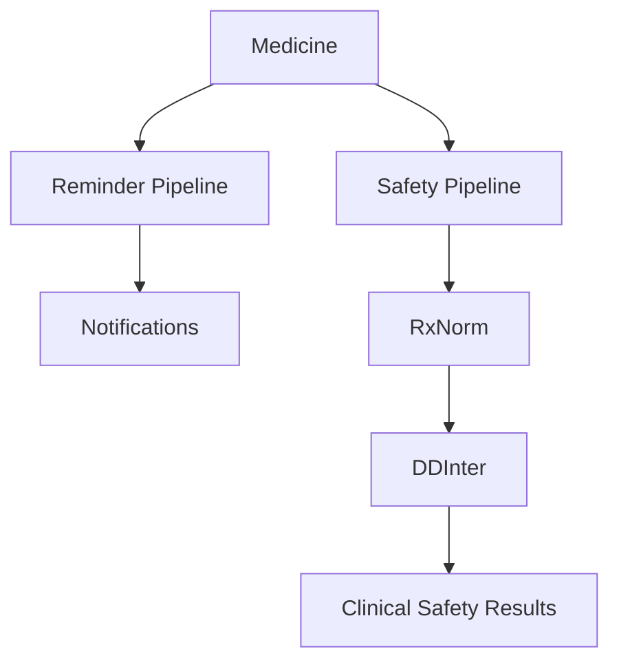

A reminder such as:

```text
08:30 AM
```

cannot modify:

- Interaction severity
- DDI detection
- Patient condition warnings
- Safety calculations

---

# 📊 Feature Overview

| Feature | Status |
|---|---|
| User Authentication | ✅ |
| Supabase JWT Verification | ✅ |
| Patient Health Profile | ✅ |
| RxNorm Medicine Search | ✅ |
| Medicine Cabinet | ✅ |
| DDInter 2.0 Integration | ✅ |
| DDInter → RxNorm Mapping | ✅ |
| Drug Interaction Detection | ✅ |
| Severity Classification | ✅ |
| openFDA Supporting Evidence | ✅ |
| Personalized Condition Warnings | ✅ |
| Safety Dashboard | ✅ |
| Medication Reminders | ✅ |
| Notification Bell | ✅ |
| English / Hindi UI | ✅ |
| Responsive UI | ✅ |
| AI Interaction Explanation | ✅ |

---

# 🚀 Future Scope

## 📄 Prescription OCR

Upload a prescription image and automatically extract medicine names.

```text
Prescription Image
       ↓
OCR
       ↓
Medicine Names
       ↓
RxNorm
       ↓
Safety Check
```

---

## 🩺 Doctor / Pharmacist Mode

Provide a more detailed clinical interface with:

- Interaction mechanisms
- Clinical references
- Detailed severity information
- Professional-oriented views

---

## 🧬 Allergy Cross-Check

Compare medicines against known patient allergies.

```text
Patient Allergies
       +
Medicine
       ↓
Allergy Safety Check
```

---

## 💊 DailyMed Integration

Add DailyMed as an additional drug-label evidence source.

---

## 🤖 Advanced AI Explanations

Generate more contextual explanations while maintaining clear safety boundaries.

---

## 📜 Interaction History

Persist safety checks for longitudinal medication-safety tracking.

---

# ⚠️ Medical Disclaimer

MediGuard is an **educational and informational medication-safety tool developed for hackathon purposes**.

It is **not a substitute for professional medical advice, diagnosis, or treatment**.

Interaction results should not be used to independently start, stop, or modify medication.

Users should always consult a qualified healthcare professional or pharmacist before making medication-related decisions.

---

# 🌐 Live Project

**MediGuard — Live Application**

https://hack-in-motion-ricr-him-1084.vercel.app/

---

# ❤️ Built For

**HackInMotion 2026**

### Team RICR — `HIM-1084`

**MediGuard**

> *Making medication safety easier to understand, one interaction at a time.*
