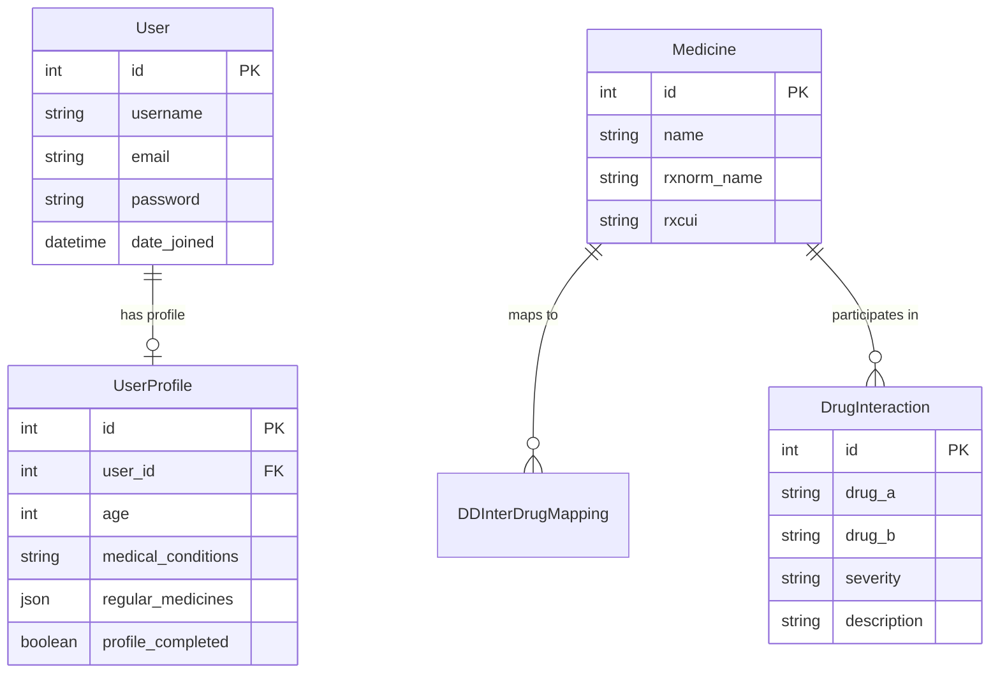

# MediGuard Backend — Django REST Framework API Service

> **Smart Medicine Safety & Drug Interaction Assistant API**
> Powered by Django 6.1, Django REST Framework, PyJWT Authentication, and DDInter 2.0 Clinical Interaction Engine.

---

## 📋 Table of Contents

1. [Overview](#overview)
2. [Key Capabilities](#key-capabilities)
3. [Technology Stack](#technology-stack)
4. [Backend Directory Structure](#backend-directory-structure)
5. [Authentication & Security System](#authentication--security-system)
6. [API Documentation & Endpoints](#api-documentation--endpoints)
7. [Database Schema & Models](#database-schema--models)
8. [Data Pipeline & DDInter 2.0 Integration](#data-pipeline--ddinter-20-integration)
9. [Patient Safety Engine](#patient-safety-engine)
10. [Local Development Setup](#local-development-setup)
11. [Production Deployment Guide](#production-deployment-guide)

---

## 🌟 Overview

The **MediGuard Backend** is a high-performance RESTful web service built with Django and Django REST Framework. It provides complete user authentication via self-contained HS256 JWT tokens, patient health profile management, medicine cabinet tracking, real-time dosage reminder notifications, and drug-drug interaction (DDI) screening using the **DDInter 2.0** clinical dataset (10,874 canonical interaction pairs across 1,405 normalized drugs).

---

## ⚡ Key Capabilities

- **Zero-Third-Party JWT Authentication**: Built-in Django authentication issuing signed HS256 `access` and `refresh` tokens with `PyJWT` and Django's `SECRET_KEY`.
- **Dual-Slash Routing**: Full support for both trailing (`/api/auth/register/`) and non-trailing (`/api/auth/register`) endpoints to guarantee zero `301` HTTP method drops or `405 Method Not Allowed` errors across Vercel / Railway / Render reverse proxies.
- **DDInter 2.0 Clinical Engine**: Offline SQL-powered interaction screening across 10,874 interaction pairs with severity breakdown (Major / Moderate / Minor).
- **Personalized Patient Safety Engine**: Overlays patient-specific medical conditions (e.g., Asthma + NSAIDs, Hypertension + Decongestants, Renal Impairment + Metformin) on top of raw drug interactions.
- **Medicine Cabinet & Schedule Tracking**: Manages active medications, dosage information, and scheduled reminder times (`08:30 AM`).
- **Production-Hardened Security**: Includes `WhiteNoise` static file compression, strict CORS regex matching (`*.vercel.app`, `*.up.railway.app`, `*.onrender.com`), and browser security headers (`NOSNIFF`, `XSS-Filter`, `X-Frame-Options: DENY`).

---

## 🛠️ Technology Stack

| Component | Technology | Version | Purpose |
|---|---|---|---|
| **Core Framework** | Django | 6.1 | Web application framework & ORM |
| **API Framework** | Django REST Framework | 3.18 | RESTful serializer and view layer |
| **JWT Authentication** | PyJWT | 2.13.0 | Token signature & verification (HS256) |
| **Database** | PostgreSQL / SQLite | 3.3 (psycopg) | Relational database storage |
| **Static Files** | WhiteNoise | 6.9.0 | Compressed production static file serving |
| **CORS Middleware** | django-cors-headers | 4.9.0 | Cross-origin resource sharing configuration |
| **Data Processing** | Pandas / NumPy | 3.0 / 2.5 | Clinical dataset cleaning and DB loading |

---

## 📂 Backend Directory Structure

```text
backend/
├── apps/
│   ├── authentication/
│   │   ├── jwt_auth.py       # Custom JWTAuthentication & token generator
│   │   ├── models.py         # UserProfile model (age, conditions, medicines)
│   │   ├── serializers.py    # RegisterSerializer, LoginSerializer, UserSerializer
│   │   ├── urls.py           # /api/auth/ endpoints (register, login, refresh, me)
│   │   └── views.py          # DRF APIViews for authentication
│   ├── interactions/
│   │   ├── models.py         # DrugInteraction & DDInterDrugMapping models
│   │   ├── services.py       # InteractionEngine pairwise lookup logic
│   │   ├── urls.py           # /api/interactions/ endpoints
│   │   └── views.py          # Pairwise interaction check views
│   ├── medicines/
│   │   ├── models.py         # Medicine model (RxNorm canonical names & CUIs)
│   │   ├── serializers.py    # MedicineSerializer
│   │   ├── urls.py           # /api/medicines/ search endpoints
│   │   └── views.py          # Medicine search & detail views
│   └── patients/
│       ├── serializers.py    # PatientProfileSerializer
│       ├── services.py       # PatientSafetyEngine (DDI + condition overlay)
│       ├── urls.py           # /api/profile/, /api/dashboard/overview/
│       └── views.py          # Profile, Dashboard overview, and Safety check views
├── config/
│   ├── settings.py           # Global Django settings, CORS, DRF, JWT setup
│   ├── urls.py               # Root URL router
│   ├── wsgi.py               # WSGI entrypoint for Gunicorn
│   └── asgi.py               # ASGI entrypoint
├── data/                     # Raw & processed DDInter 2.0 interaction CSVs
├── Dockerfile                # Production Docker container definition
├── Procfile                  # Railway / Render start command
├── requirements.txt          # Python dependency pinfile
└── manage.py                 # Django management CLI
```

---

## 🔐 Authentication & Security System

MediGuard uses a self-contained **JWT Authentication System** operating entirely within the Django backend.

### Token Specifications
- **Access Token**: Valid for **24 hours**. Contains `user_id`, `email`, `username`, `token_type: "access"`, `iat`, and `exp`.
- **Refresh Token**: Valid for **7 days**. Contains `user_id`, `token_type: "refresh"`, `iat`, and `exp`.
- **Algorithm**: `HS256` signed using `settings.SECRET_KEY`.

### Authentication Flow
1. **Registration** (`POST /api/auth/register`): Hashes password with `PBKDF2PasswordHasher`, creates `User` and `UserProfile`, issues access & refresh tokens.
2. **Login** (`POST /api/auth/login`): Validates credentials using `django.contrib.auth.authenticate()`, issues new access & refresh tokens.
3. **Protected Calls**: Client attaches header `Authorization: Bearer <access_token>`.
4. **Token Refresh** (`POST /api/auth/refresh`): Client sends `{ "refresh": "<refresh_token>" }` to receive a fresh access token without re-entering credentials.

---

## 📡 API Documentation & Endpoints

All endpoints support both slash (`/`) and non-slash endings.

### 🔑 Authentication Endpoints

| Method | Endpoint | Description | Auth Required |
|---|---|---|---|
| `POST` | `/api/auth/register/` | Register new user & return JWT tokens | ❌ Public |
| `POST` | `/api/auth/login/` | Authenticate user & return JWT tokens | ❌ Public |
| `POST` | `/api/auth/refresh/` | Obtain new access token using refresh token | ❌ Public |
| `POST` | `/api/auth/logout/` | Invalidates local session | ✅ Bearer JWT |
| `GET` | `/api/auth/me/` | Fetch authenticated user data & profile status | ✅ Bearer JWT |
| `POST` | `/api/auth/profile/onboarding/` | Complete initial onboarding health profile | ✅ Bearer JWT |

#### Example: Register Request
`POST /api/auth/register/`
```json
{
  "email": "patient@example.com",
  "password": "Password123",
  "fullName": "Jane Doe"
}
```
#### Example: Register Success Response (`201 Created`)
```json
{
  "success": true,
  "message": "Account created successfully",
  "tokens": {
    "access": "eyJhbGciOiJIUzI1NiIsInR5cCI6IkpXVCJ9...",
    "refresh": "eyJhbGciOiJIUzI1NiIsInR5cCI6IkpXVCJ9...",
    "expires_in": 86400
  },
  "user": {
    "id": 1,
    "email": "patient@example.com",
    "fullName": "Jane Doe",
    "profileCompleted": false
  }
}
```

---

### 💊 Medicines & Interaction Endpoints

| Method | Endpoint | Description | Auth Required |
|---|---|---|---|
| `GET` | `/api/medicines/` | Search medicines by query (`?search=paracetamol`) | ❌ Public |
| `GET` | `/api/medicines/{id}/` | Get medicine details by ID | ❌ Public |
| `POST` | `/api/interactions/check/` | Check interaction between drug array | ❌ Public |

---

### 👤 Patient Profile & Dashboard Endpoints

| Method | Endpoint | Description | Auth Required |
|---|---|---|---|
| `GET` | `/api/profile/` | Retrieve health profile (medicines, age, conditions) | ✅ Bearer JWT |
| `POST` | `/api/profile/` | Create or update health profile | ✅ Bearer JWT |
| `PATCH` | `/api/profile/` | Partial update of health profile | ✅ Bearer JWT |
| `GET` | `/api/dashboard/overview/` | Dashboard summary metrics & active warnings | ✅ Bearer JWT |
| `POST` | `/api/patients/safety-check/` | Run personalized DDI + condition safety check | ✅ Bearer JWT |

---

## 🗄️ Database Schema & Models



---

## 🔬 Data Pipeline & DDInter 2.0 Integration

The MediGuard interaction engine is powered by **DDInter 2.0**:
- **10,874 Canonical Drug Pairs**: Pre-indexed by drug names and RxNorm CUIs.
- **Severity Levels**:
  - 🔴 **Major**: Potentially life-threatening or requires immediate medical intervention.
  - 🟠 **Moderate**: May worsen symptoms or require dosage adjustments.
  - 🟢 **Minor**: Mild effect; monitoring recommended.

All interaction checks execute in high-speed SQL queries directly against the database with zero external runtime API latency.

---

## 🩺 Patient Safety Engine

Beyond pairwise drug interactions, `PatientSafetyEngine` (`apps/patients/services.py`) evaluates patient medical conditions:

| Medical Condition | Rule Triggers | Warning Generated |
|---|---|---|
| **Asthma** | NSAIDs (Aspirin, Ibuprofen, Naproxen) | 🔴 Major: May trigger severe bronchospasm |
| **Renal Impairment** | Metformin / NSAIDs | 🔴 Major: Risk of lactic acidosis or acute kidney injury |
| **Hypertension** | Decongestants (Pseudoephedrine) | 🟠 Moderate: May elevate blood pressure |
| **Diabetes** | Beta-blockers | 🟠 Moderate: May mask symptoms of hypoglycemia |

---

## 💻 Local Development Setup

### Prerequisites
- Python 3.11+
- pip & virtualenv

### Setup Steps

1. **Clone repository & navigate to backend**:
   ```bash
   git clone https://github.com/Anshikakhandelwall/HackInMotion-RICR-HIM-1084.git
   cd HackInMotion-RICR-HIM-1084/backend
   ```

2. **Create and activate virtual environment**:
   ```bash
   python -m venv venv
   source venv/bin/activate    # Linux / macOS
   # venv\Scripts\activate     # Windows
   ```

3. **Install dependencies**:
   ```bash
   pip install -r requirements.txt
   ```

4. **Set environment variables**:
   ```bash
   export DJANGO_SECRET_KEY="local-dev-secret-key-change-in-production"
   export DEBUG="True"
   ```

5. **Run migrations & start development server**:
   ```bash
   python manage.py migrate
   python manage.py runserver 0.0.0.0:8000
   ```

The REST API is now live at `http://localhost:8000/`.

---

## 🚢 Production Deployment Guide

### Deployment Options

#### 1. Containerized Deployment (Docker / Render / Railway)
Use the included `Dockerfile`:
```bash
docker build -t mediguard-backend .
docker run -p 8000:8000 -e DJANGO_SECRET_KEY="your-secret-key" mediguard-backend
```

#### 2. Render Deployment (`render.yaml`)
Deploy using Render Blueprint with `render.yaml`:
```yaml
services:
  - type: web
    name: mediguard-backend
    runtime: docker
    dockerfilePath: ./backend/Dockerfile
    dockerContext: ./backend
```

#### 3. Railway / Gunicorn Deployment (`Procfile`)
```text
web: cd backend && python manage.py migrate && gunicorn config.wsgi:application --bind 0.0.0.0:$PORT --workers 3 --timeout 120
```

---

*Built with ❤️ for HackInMotion 2026 — Team RICR (HIM-1084)*
