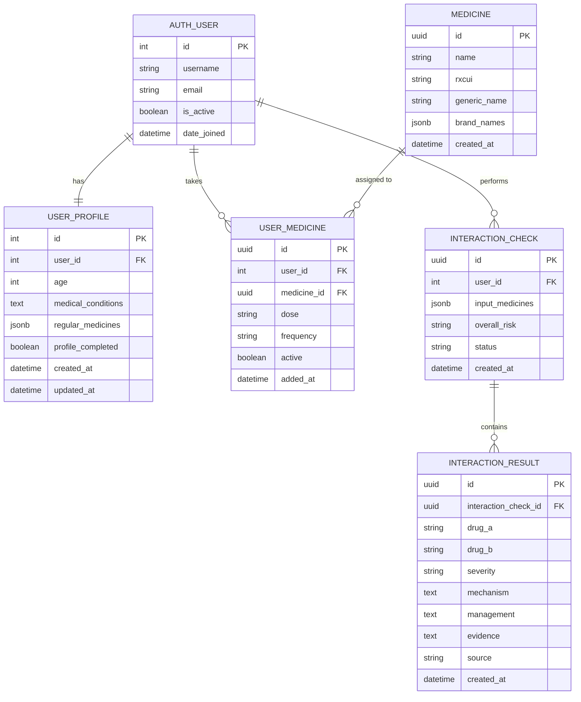

# Database Documentation

# MediGuard — Database Documentation

## 1. Database Overview

MediGuard uses **PostgreSQL** as its persistent database, accessed through the Django backend.

The database is responsible for storing:

- User identity mapped from Supabase Authentication
- Patient health profiles
- Age and medical conditions
- Current/regular medicines
- Profile completion status
- Timestamps for profile creation and updates
- Future medicine interaction history and safety-check records

The application follows a **backend-owned data access model**:

```text
Frontend
   │
   │ HTTPS / REST API
   ▼
Django REST Framework
   │
   │ Django ORM
   ▼
PostgreSQL
```

Supabase Authentication is used for authentication, while Django is responsible for application data and authorization.

---

# 2. Database Technology

| Component | Technology |
|---|---|
| Database | PostgreSQL |
| Database Provider | Supabase PostgreSQL |
| Backend ORM | Django ORM |
| Backend Framework | Django REST Framework |
| Authentication | Supabase Auth |
| Database API | Django REST API |
| Structured JSON storage | PostgreSQL JSONB through Django `JSONField` |

Django's `JSONField` is stored as PostgreSQL `jsonb`, making it suitable for structured values such as a user's list of regular medicines. citeturn0search0

---

# 3. Database Architecture

MediGuard separates authentication identity from application-specific patient information.

```text
                  ┌─────────────────────────┐
                  │      Supabase Auth      │
                  │                         │
                  │ email                    │
                  │ password                 │
                  │ Supabase User UUID       │
                  └────────────┬────────────┘
                               │
                               │ JWT `sub`
                               ▼
                  ┌─────────────────────────┐
                  │      Django User        │
                  │                         │
                  │ id                      │
                  │ username = Supabase sub │
                  │ email                   │
                  │ is_active               │
                  └────────────┬────────────┘
                               │
                         1 : 1 │
                               ▼
                  ┌─────────────────────────┐
                  │       UserProfile       │
                  │                         │
                  │ age                     │
                  │ medical_conditions      │
                  │ regular_medicines       │
                  │ profile_completed       │
                  │ created_at              │
                  │ updated_at              │
                  └─────────────────────────┘
```

A Django `OneToOneField` is used to associate one profile with one Django user. This is appropriate for extending a user record with application-specific information. citeturn0search0

---

# 4. Current Database Schema

The currently implemented application uses the following main application-level tables:

1. `auth_user`
2. `authentication_userprofile`

The `auth_user` table is Django's built-in user table.

The `UserProfile` table stores MediGuard-specific patient information.

---

# 5. Django User Table

## Table: `auth_user`

This table is provided by Django's authentication system.

It represents the authenticated application user.

### Important Fields

| Field | Type | Description |
|---|---|---|
| `id` | Integer | Primary key |
| `username` | VARCHAR | Stores the Supabase user UUID |
| `email` | VARCHAR | User's email address |
| `password` | VARCHAR | Django-managed password field |
| `is_active` | Boolean | Whether the Django user is active |
| `is_staff` | Boolean | Django administrative access |
| `is_superuser` | Boolean | Django superuser flag |
| `date_joined` | DateTime | Account creation timestamp |

### Supabase Identity Mapping

MediGuard does not use the user's email as the primary identity mapping.

Instead:

```text
Supabase JWT
      │
      ▼
sub = Supabase User UUID
      │
      ▼
Django User.username
```

For example:

```text
Supabase user ID:
550e8400-e29b-41d4-a716-446655440000

Django:
username =
550e8400-e29b-41d4-a716-446655440000
```

This gives every authenticated Supabase user a corresponding Django identity.

---

# 6. UserProfile Table

## Table: `authentication_userprofile`

The `UserProfile` table contains patient-specific health information.

### Schema

| Field | Type | Constraints | Description |
|---|---|---|---|
| `id` | Integer | Primary Key | Unique profile ID |
| `user_id` | Integer | One-to-One / Foreign Key | Links profile to Django user |
| `age` | Integer | Nullable, validated 1–120 | Patient age |
| `medical_conditions` | Text | Nullable / Blank allowed | Existing diseases or medical conditions |
| `regular_medicines` | JSONB | List structure | Medicines currently taken |
| `profile_completed` | Boolean | Default false | Indicates whether required profile data has been completed |
| `created_at` | DateTime | Auto-created | Profile creation time |
| `updated_at` | DateTime | Auto-updated | Last profile modification |

---

# 7. UserProfile Relationships

The relationship is:

```text
Django User
     │
     │ 1
     │
     │
     │ 1
     ▼
 UserProfile
```

Each Django user can have exactly one patient profile.

The relationship is implemented using a Django `OneToOneField`.

### Ownership Rule

A profile is always accessed through:

```python
request.user
```

The frontend does **not** send a user ID to decide whose profile should be returned.

The backend performs the equivalent of:

```python
UserProfile.objects.get(user=request.user)
```

This prevents one authenticated user from requesting another user's profile simply by changing an ID in the request.

---

# 8. Regular Medicines Storage

The current implementation stores the user's regular medicines inside:

```text
authentication_userprofile.regular_medicines
```

This field uses PostgreSQL JSONB through Django's `JSONField`.

Example stored value:

```json
[
  "Warfarin",
  "Aspirin",
  "Metformin"
]
```

This approach is useful for the current profile implementation because the medicine list is naturally represented as a structured JSON array.

However, as the medicine-management system becomes more advanced, medicines should be moved into dedicated relational tables.

---

# 9. Profile Completion

The database contains:

```text
profile_completed
```

This value indicates whether the minimum health profile information has been provided.

Currently, the profile is considered complete when:

```text
age is present
        AND
medical_conditions is present
```

Example:

```text
age = 56
medical_conditions = "Diabetes"
```

Result:

```text
profile_completed = true
```

If the required information is missing:

```text
profile_completed = false
```

This value is stored in PostgreSQL rather than relying on browser `localStorage`.

---

# 10. Profile Data Flow

When a user logs in:

```text
User
 │
 ▼
Supabase Auth
 │
 ▼
JWT Access Token
 │
 ▼
Frontend
 │
 │ Authorization: Bearer <JWT>
 ▼
Django API
 │
 ▼
SupabaseAuthentication
 │
 ├── Verify JWT
 ├── Extract `sub`
 └── Resolve Django User
 │
 ▼
UserProfile
 │
 ▼
GET /api/profile/
 │
 ▼
Frontend
 │
 ├── profile_completed = true
 │       └── Dashboard
 │
 └── profile_completed = false
         └── Health Profile
```

---

# 11. Profile API and Database Operations

## GET `/api/profile/`

Returns the authenticated user's profile.

```text
Frontend
   │
   │ GET /api/profile/
   ▼
Django
   │
   ├── Verify JWT
   ├── Identify request.user
   │
   ▼
UserProfile
   │
   ▼
Return profile
```

If no profile exists:

```json
{
  "profile_exists": false
}
```

---

## POST `/api/profile/`

Creates or updates the authenticated user's profile.

Example request:

```json
{
  "age": 56,
  "medicalConditions": "Diabetes",
  "regularMedicines": [
    "Metformin",
    "Aspirin"
  ]
}
```

The backend determines the owner from:

```text
request.user
```

and not from a user ID supplied by the frontend.

---

## PATCH `/api/profile/`

Updates an existing profile partially.

Example:

```json
{
  "medicalConditions": "Diabetes, Hypertension"
}
```

---

# 12. Database Security and Ownership

MediGuard follows a user-ownership model.

```text
JWT
 │
 ▼
Supabase User UUID
 │
 ▼
Django User
 │
 ▼
UserProfile
```

A user can only access the profile associated with their authenticated identity.

### Important Security Rule

The API does not trust:

```json
{
  "user_id": 123
}
```

from the client.

Instead, it trusts the verified JWT.

```python
request.user
```

This prevents unauthorized cross-user access.

---

# 13. Authentication Data vs Application Data

These two types of data are intentionally separated.

### Supabase Authentication

Supabase manages:

- Email
- Password authentication
- Email confirmation
- Sessions
- Access tokens
- Refresh tokens
- Supabase user UUID

### Django/PostgreSQL

MediGuard stores:

- Django user identity
- Patient age
- Medical conditions
- Regular medicines
- Profile completion
- Application-specific data

Conceptually:

```text
┌───────────────────────┐
│     SUPABASE AUTH     │
│                       │
│ Authentication        │
│ Sessions              │
│ JWT                   │
│ User UUID             │
└───────────┬───────────┘
            │
            │ JWT
            ▼
┌───────────────────────┐
│        DJANGO         │
│                       │
│ Authorization         │
│ Application logic     │
│ API                    │
└───────────┬───────────┘
            │
            ▼
┌───────────────────────┐
│      POSTGRESQL       │
│                       │
│ User                  │
│ UserProfile           │
│ Medicines             │
│ Interaction History   │
└───────────────────────┘
```

---

# 14. Planned Medicine Database

The current implementation stores regular medicines in `UserProfile.regular_medicines`.

For the complete MediGuard medicine-management system, the database should evolve to dedicated medicine tables.

The target structure is:

```text
User
 │
 ├─────────────── UserProfile
 │
 ├─────────────── UserMedicine
 │                    │
 │                    ▼
 │                 Medicine
 │
 └─────────────── InteractionCheck
                      │
                      └── InteractionResult
```

This will allow the application to support:

- Thousands of medicines
- RxNorm identifiers
- RxCUI values
- Generic and brand names
- Current medication lists
- Medicine history
- Interaction history
- Multiple interaction results per check

---

# 15. Planned Medicine Table

## Table: `medicine`

This table should represent normalized medicines.

| Field | Type | Description |
|---|---|---|
| `id` | UUID / Integer | Primary key |
| `name` | VARCHAR | Normalized medicine name |
| `rxcui` | VARCHAR | RxNorm Concept Unique Identifier |
| `generic_name` | VARCHAR | Generic medicine name |
| `brand_names` | JSONB | Known brand names |
| `created_at` | DateTime | Record creation time |

Example:

```text
name: Warfarin
rxcui: <RxCUI>
generic_name: Warfarin
```

RxNorm is used by the application as the normalization layer before interaction checking.

---

# 16. Planned UserMedicine Table

## Table: `user_medicine`

This table connects a user with medicines they currently take.

| Field | Type | Description |
|---|---|---|
| `id` | UUID / Integer | Primary key |
| `user_id` | Foreign Key | Owner |
| `medicine_id` | Foreign Key | Medicine |
| `dose` | VARCHAR | Optional dosage |
| `frequency` | VARCHAR | Optional frequency |
| `active` | Boolean | Whether medicine is currently active |
| `added_at` | DateTime | When medicine was added |

Relationship:

```text
User 1 ──────── * UserMedicine * ──────── 1 Medicine
```

---

# 17. Planned InteractionCheck Table

## Table: `interaction_check`

Stores every interaction-check request.

| Field | Type | Description |
|---|---|---|
| `id` | UUID / Integer | Primary key |
| `user_id` | Foreign Key | User who performed the check |
| `created_at` | DateTime | Check timestamp |
| `overall_risk` | VARCHAR | Overall risk classification |
| `input_medicines` | JSONB | Medicines submitted for checking |
| `status` | VARCHAR | Success/error state |

Example:

```json
{
  "input_medicines": [
    "Warfarin",
    "Aspirin"
  ],
  "overall_risk": "severe",
  "status": "success"
}
```

---

# 18. Planned InteractionResult Table

## Table: `interaction_result`

Stores individual interaction findings returned by the drug-data pipeline.

| Field | Type | Description |
|---|---|---|
| `id` | UUID / Integer | Primary key |
| `interaction_check_id` | Foreign Key | Parent check |
| `drug_a` | VARCHAR | First medicine |
| `drug_b` | VARCHAR | Second medicine |
| `severity` | VARCHAR | Mild / Moderate / Severe |
| `mechanism` | Text | Interaction mechanism |
| `management` | Text | Recommended management |
| `evidence` | Text | Supporting evidence |
| `source` | VARCHAR | DDInter / openFDA / other |
| `created_at` | DateTime | Result creation time |

Relationship:

```text
InteractionCheck 1 ──────── * InteractionResult
```

---

# 19. Target ER Diagram

The following diagram represents the intended complete MediGuard database architecture.



---

# 20. Current vs Planned Database

| Component | Status |
|---|---|
| PostgreSQL database | Implemented |
| Supabase PostgreSQL | Implemented |
| Supabase Authentication | Implemented |
| Django User mapping | Implemented |
| UserProfile | Implemented |
| Age storage | Implemented |
| Medical conditions | Implemented |
| Regular medicines in profile | Implemented |
| Profile completion | Implemented |
| Medicine normalization table | Planned / next phase |
| Dedicated UserMedicine table | Planned / next phase |
| InteractionCheck table | Planned / next phase |
| InteractionResult table | Planned / next phase |
| Medicine history | Planned / next phase |
| Interaction history | Planned / next phase |

This distinction is important: the current database documentation should not claim that interaction-history tables already exist if they have not yet been implemented.

---

# 21. Drug Interaction Data Flow

The final database architecture will support the following flow:

```text
User
 │
 │ enters
 ▼
Warfarin + Aspirin
 │
 ▼
Django API
 │
 ├──────────────► RxNorm
 │                  │
 │                  ▼
 │                RxCUI
 │
 ▼
Interaction Engine
 │
 ▼
DDInter
 │
 ├── Interaction
 ├── Severity
 ├── Mechanism
 ├── Management
 └── Evidence
 │
 ▼
openFDA
 │
 ├── Drug label
 ├── Interactions
 ├── Warnings
 └── Precautions
 │
 ▼
Patient Health Profile
 │
 ├── Age
 ├── Medical conditions
 ├── Allergies
 └── Existing medicines
 │
 ▼
Safety Assessment
 │
 ├── Risk level
 ├── Explanation
 ├── Evidence
 └── Recommendation
 │
 ▼
InteractionCheck
 │
 ▼
InteractionResult
```

The database therefore acts as the persistent layer around the external drug-information services rather than replacing those services.

---

# 22. Privacy Considerations

MediGuard stores sensitive patient-related information.

The following rules are followed:

1. Users can only access their own profile.
2. Authentication is handled through Supabase Auth.
3. Django verifies the Supabase JWT before protected API access.
4. The JWT `sub` claim identifies the user.
5. Profile ownership is determined using `request.user`.
6. User IDs are not trusted from request bodies.
7. Health information is stored in PostgreSQL rather than browser-only storage.
8. API responses should expose only the information required by the authenticated user.
9. External drug APIs receive medicine information required for the interaction check, not unnecessary patient identity information.
10. Authentication tokens and API secrets must never be committed to Git.

---

# 23. Environment Variables

The application requires environment variables for database and external-service configuration.

Example backend configuration:

```env
SUPABASE_URL=https://<project-ref>.supabase.co
SUPABASE_JWT_ISSUER=https://<project-ref>.supabase.co/auth/v1
SUPABASE_JWKS_URL=https://<project-ref>.supabase.co/auth/v1/.well-known/jwks.json
```

Frontend configuration:

```env
VITE_SUPABASE_URL=https://<project-ref>.supabase.co
VITE_SUPABASE_PUBLISHABLE_KEY=<publishable-or-anon-key>
```

External drug-data services should also be configured through environment variables rather than hardcoded credentials.

Example:

```env
OPENFDA_API_KEY=<your-key>
```

---

# 24. Database Access Pattern

The frontend never directly modifies PostgreSQL tables.

Instead:

```text
React Frontend
      │
      │ REST API
      ▼
Django REST Framework
      │
      │ authentication
      ▼
Supabase JWT Verification
      │
      ▼
Django ORM
      │
      ▼
PostgreSQL
```

This provides a single controlled point for:

- Authentication
- Authorization
- Validation
- Business logic
- Database access
- Drug interaction processing

---

# 25. Error Handling

Database-related errors should be converted into safe API responses.

Examples:

### Profile not found

```json
{
  "profile_exists": false
}
```

### Invalid age

```json
{
  "age": [
    "Age must be between 1 and 120."
  ]
}
```

### Invalid medicine list

```json
{
  "regularMedicines": [
    "Expected a list of medicines."
  ]
}
```

### Database/API failure

The frontend should display a user-friendly message instead of exposing raw database errors.

---

# 26. Data Persistence

Unlike the initial prototype, important user data is not dependent on browser `localStorage`.

The persistence chain is:

```text
User Input
   │
   ▼
Frontend Form
   │
   ▼
Django REST API
   │
   ▼
Django Serializer
   │
   ▼
Django ORM
   │
   ▼
PostgreSQL
```

Therefore, the user's profile can be retrieved after:

- Browser refresh
- Logout/login
- Device change
- Session restoration

provided the user authenticates with the same account.

---

# 27. Database Design Rationale

The current design intentionally starts with a simple patient profile.

This makes the first version easy to implement while leaving room for a more normalized medicine system.

### Current design

```text
User
  │
  └── UserProfile
          │
          └── regular_medicines JSONB
```

### Final design

```text
User
 │
 ├── UserProfile
 │
 ├── UserMedicine ─── Medicine
 │
 └── InteractionCheck
          │
          └── InteractionResult
```

The final design is preferable once medicine management and history become core features because individual medicines and interaction results can then be queried, indexed, and reused independently.

---

# 28. Summary

MediGuard currently uses PostgreSQL as its persistent application database with Django ORM managing access to the database.

The implemented database layer provides:

- Secure user identity mapping
- One-to-one patient profiles
- Patient age storage
- Medical-condition storage
- Current medicine storage
- Profile completion tracking
- Timestamped profile updates
- User-specific data ownership

The next database expansion is the dedicated medicine and interaction-history layer:

```text
User
 │
 ├── UserProfile
 │
 ├── UserMedicine
 │       │
 │       └── Medicine
 │
 └── InteractionCheck
          │
          └── InteractionResult
```

This architecture supports the hackathon's core requirement of maintaining a user's current medicines and storing previous safety checks while keeping patient data isolated between users.

---

## 29. Database Status

**Current implementation:** PostgreSQL + Django ORM + Supabase Authentication

**Implemented:** Authentication identity, patient profile, health information, regular medicines, profile completion

**Next database milestone:** Dedicated medicine records, user medication lists, interaction-check history, and interaction-result persistence

**Primary database principle:**

> Authentication identifies the user; Django authorizes the user; PostgreSQL stores the user's application data; external drug-data APIs provide medical interaction information.