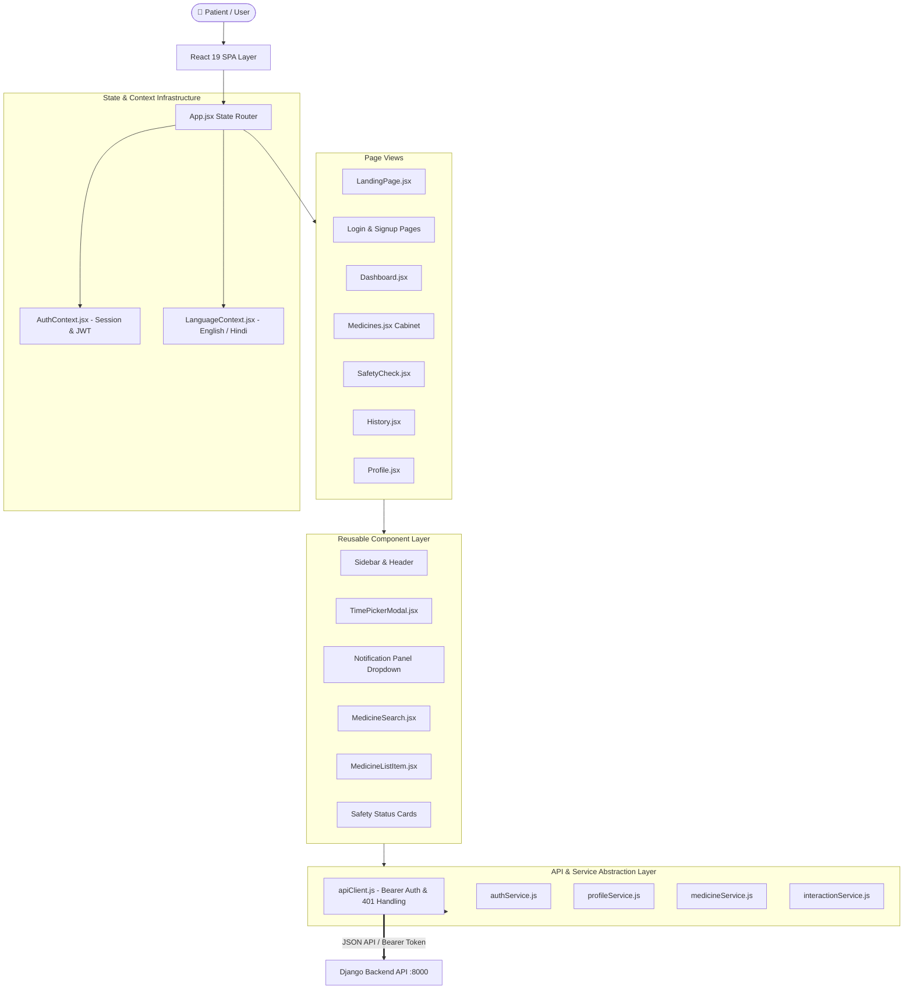
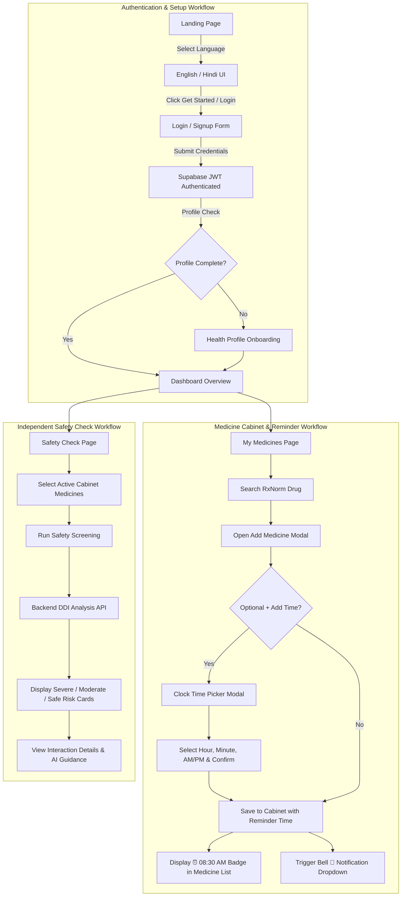
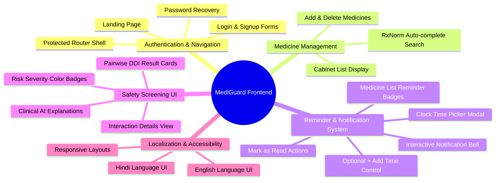
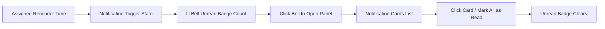
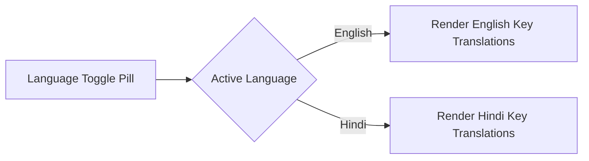
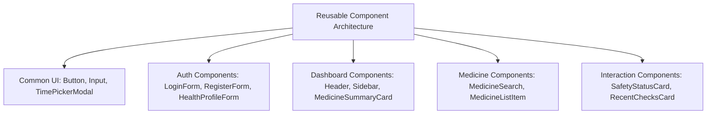
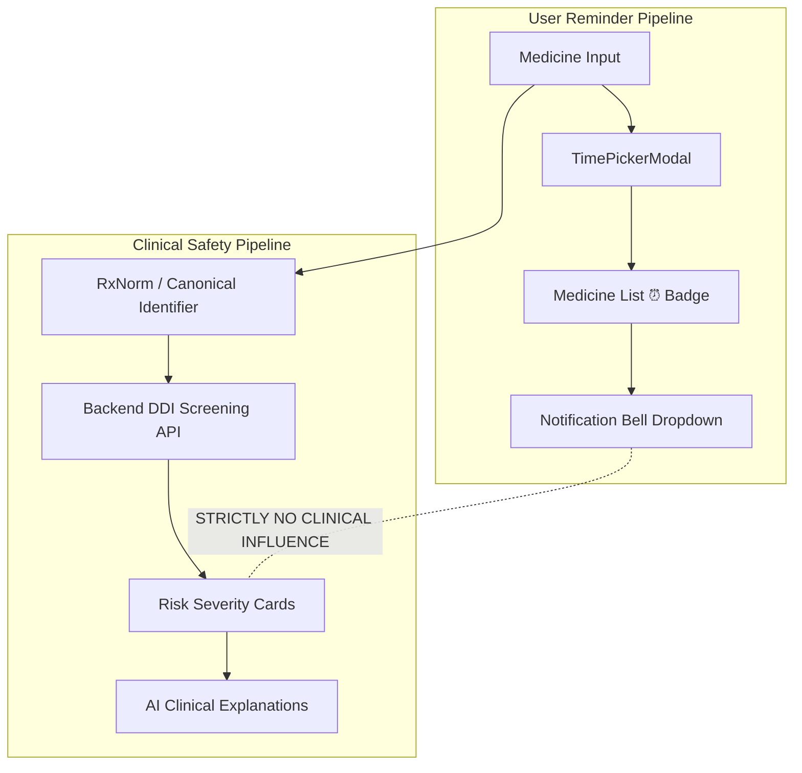

🛡️ MediGuard — Frontend Documentation

📌 Project & Team Information
Project Name: MediGuard
Event: HackInMotion — RICR
Team Code: `RICR-HIM-1084`
Team Members:
Anshika Khandelwal — Team Leader
Divya
Anshul Sharma
Shivendra Chauhan
Documentation Focus: Dedicated Frontend Architectural & Technical Contribution Documentation
---
📑 Table of Contents
Frontend Overview
Frontend Tech Stack
Frontend Architecture
Frontend Directory Structure
Complete User Workflow
Frontend Feature Map
Medicine Reminder System
Notification System
Multi-Language Frontend (i18n)
Safety & Interaction Frontend
Responsive Design
Component Reuse
Frontend Data Flow
Frontend Safety Boundaries
UI/UX Design Principles
Frontend Quality & Static Analysis
Frontend Build & Development
Frontend Contribution Summary
Combined Architecture & Workflow Visual
Frontend Screens Preview
---
1. 🔍 Frontend Overview
The MediGuard frontend is a single-page application (SPA) crafted with React 19 and Vite 8. It serves as the primary visual interface for users to monitor their prescription routines and review medication safety evaluations.
Key Workflows Delivered:
Landing Page & Authentication: Welcomes visitors with a modern landing page, seamless registration/login forms with input validation, password recovery, and Supabase JWT authentication.
Cabinet & Reminder Management: Enables users to maintain an active medication cabinet, search canonical RxNorm drugs, and optionally assign alarm-style reminder times (`⏰ 08:30 AM`) using a custom clock time picker.
Interactive Notifications: Features an interactive header notification bell 🔔 with unread count badges, dropdown notification cards, and "Mark as Read" functionality.
Safety & Interaction Visualization: Renders clinical drug-drug interaction (DDI) safety checks, risk level cards (`Severe`, `Moderate`, `Minor`), and detailed AI-generated patient safety explanations.
Bilingual Support: Provides instant English/Hindi switching across all views, forms, modals, and error messages via a custom context provider (`LanguageContext.jsx`).
> **Architectural Separation Note:** The frontend maintains a strict visual and functional separation between user-facing reminder scheduling and clinical drug interaction calculations. Reminder attributes never alter clinical safety checks or severity outputs.
---
2. 🛠️ Frontend Tech Stack
Technology	Role / Responsibility	Version / Details
React	Declarative Component-driven UI Development	`v19.2.8`
Vite	Development server & HMR build tool	`v8.2.0`
JavaScript (ES6+)	Frontend application logic & state management	Native Modern ES
Vanilla CSS3	Custom design tokens (`--color-primary`), animations & responsive styling	Modular CSS files per page/component
Supabase JS Client	Authentication session management & JWT token handling	`@supabase/supabase-js v2.31.0`
Oxlint	High-performance static code analysis and linting	`v1.75.0`
Language Context	Context API for dynamic English/Hindi localization	`LanguageContext.jsx`
---
3. 🏗️ Frontend Architecture
The application adopts a state-machine router pattern (`App.jsx`) combined with global context providers (`AuthContext.jsx`, `LanguageContext.jsx`) and a service abstraction layer (`apiClient.js`) that attaches Bearer tokens automatically.

---
4. 📁 Frontend Directory Structure
```text
frontend/
├── public/                     # Static public assets
├── src/
│   ├── assets/                 # Brand graphics and illustrations
│   ├── components/             # Reusable UI component modules
│   │   ├── auth/               # LoginForm, RegisterForm, HealthProfileForm
│   │   ├── common/             # Button, Input, TimePickerModal, BrandLogo
│   │   ├── dashboard/          # Header, Sidebar, QuickActions, SummaryCards
│   │   ├── history/            # History list and detail items
│   │   ├── interactions/       # Safety check forms, Interaction Cards
│   │   └── medicines/          # MedicineSearch, MedicineListItem
│   ├── context/                # Global React Contexts
│   │   ├── AuthContext.jsx     # Supabase auth session listener
│   │   └── LanguageContext.jsx # English/Hindi translation provider
│   ├── hooks/                  # Custom hooks (useAuth.js)
│   ├── pages/                  # Top-level page views
│   │   ├── Dashboard/          # Dashboard summary page
│   │   ├── ForgotPassword/     # Password reset request view
│   │   ├── HealthProfile/      # Health profile onboarding view
│   │   ├── History/            # Safety check history view
│   │   ├── Landing/            # Product landing page view
│   │   ├── Login/              # User sign-in page view
│   │   ├── Medicines/          # Medicine cabinet management view
│   │   ├── Profile/            # User profile view
│   │   ├── ResetPassword/      # Password update recovery view
│   │   ├── SafetyCheck/        # Drug-drug interaction screening view
│   │   ├── Settings/           # Account settings view
│   │   └── Signup/             # User registration page view
│   ├── services/               # Data fetching & API service layer
│   │   ├── api/                # apiClient.js fetch wrapper
│   │   ├── auth/               # authService.js (Supabase Auth)
│   │   ├── history/            # historyService.js (Local & backend history)
│   │   ├── interactions/       # interactionService.js (DDI API)
│   │   ├── medicines/          # medicineService.js (RxNorm lookup API)
│   │   └── profile/            # profileService.js (Patient profile API)
│   ├── styles/                 # Global styling system (index.css)
│   ├── utils/                  # Formatting and validation helpers
│   ├── App.jsx                 # App shell router & state machine
│   ├── App.css                 # App root layout styles
│   ├── index.css               # Design tokens & CSS resets
│   └── main.jsx                # Application bootstrap entry point
├── .oxlintrc.json              # Oxlint linting configuration
├── FRONTEND_STRUCTURE.md       # Directory architecture documentation
├── index.html                  # HTML5 container
├── package.json                # Dependencies and npm scripts
├── vite.config.js              # Vite server & proxy configuration
└── vercel.json                 # Vercel deployment rewrite rules
```
---
5. 🔄 Complete User Workflow

---
6. 🗺️ Frontend Feature Map

---
7. ⏰ Medicine Reminder System
The frontend provides a complete user interface for managing medication schedules:
1. Add Reminder Control
When adding a new medicine in `Medicines.jsx`, users can optionally click `+ Add Time` to assign a reminder schedule.
2. Clock-Style Time Picker Modal (`TimePickerModal.jsx`)
Hour & Minute Selection: Grid selectors for Hours (01–12) and Minutes (00–55 in 5-minute increments).
Period Toggle: AM / PM selector buttons.
Modal Controls: Digital header display (`08:30 AM`), Backdrop-click dismissal without saving, and explicit Done confirmation.
3. Cabinet List Badge Display
When a reminder time is assigned, `MedicineListItem.jsx` renders a clean badge:
```text
💊 Paracetamol    ⏰ 08:30 AM
```
If no reminder is assigned, the medicine row displays cleanly with no badge or "Not set" placeholder text.
---
8. 🔔 Notification System
The header features an interactive notification bell system (`Header.jsx`, `Header.css`):

Key UI Features:
Unread Counter Badge: Displays a badge count (`🔔 2`) on the bell, hiding automatically when all notifications are marked as read.
Notification Cards: Displays concise message cards (e.g., "It's time for your Paracetamol reminder." with time tag `⏰ 08:30 AM`).
Mark as Read Actions: Individual card click to mark read and a top-level `"Mark all as read"` button.
Outside-Click Detection: Uses custom React refs and event listeners to close the panel when clicking outside.
---
9. 🌐 Multi-Language Frontend (i18n)
The app includes full internationalization managed by `LanguageContext.jsx`:

Coverage: Covers 100% of user-facing components including navigation items, dashboard cards, cabinet buttons, reminder controls, time picker modal, safety status indicators, and error alerts.
Switching: Toggled via navbar button without requiring page reloads or backend requests.
---
10. 🛡️ Safety & Interaction Frontend
The frontend handles medication safety checking via dedicated, patient-friendly interfaces:
```text
Cabinet Medicine Selection ➔ Run Safety Screening ➔ Risk Summary Card ➔ Interaction Cards ➔ View Details ➔ AI Safety Explanation
```
Risk Level Badges: Highlights interactions by severity level:
🔴 Severe: High risk requiring immediate medical review.
🟡 Moderate: Moderate risk requiring precaution.
🟢 Safe: No drug-drug interactions detected across selected combination.
Interaction Details View (`InteractionDetails.jsx`): Renders clinical references, symptoms to watch for, and AI-generated explanations.
---
11. 📱 Responsive Design
The frontend is engineered with mobile-first Vanilla CSS principles:
Desktop & Laptop (>1024px): Multi-column dashboard grid, persistent sidebar navigation, right-aligned notification panel dropdown.
Tablet (768px – 1024px): Responsive 2-column feature cards and adaptive modal sizes.
Mobile (<768px): Collapsible hamburger navigation drawer, stacked hero sections, full-width time picker modal, and viewport-constrained notification dropdowns.
---
12. 🧩 Component Reuse
To promote maintainability and consistency, the frontend relies on a structured component taxonomy:

---
13. 📡 Frontend Data Flow
```text
User Action (Click / Form Input)
       ↓
React Component State Update
       ↓
Frontend Service Execution (e.g., medicineService.js)
       ↓
apiClient.js Wrapper (Attaches Bearer JWT Token)
       ↓
HTTP Fetch Request to Django API / Supabase
       ↓
JSON Response Received & Parsed
       ↓
React State Re-render & Toast/Alert UI Update
```
---
14. 🔒 Frontend Safety Boundaries
A foundational architectural rule of MediGuard is the strict separation between user reminder schedules and clinical safety calculations:

---
15. 🎨 UI/UX Design Principles
MediGuard Color Palette: Built around a brick-red primary accent (`#A63D35`), warm card surfaces (`#FFFDFC`), subtle borders (`#E9DDD9`), and charcoal typography (`#24201F`).
Micro-Interactions: Smooth hover transitions on action buttons, card elevation on hover, and smooth modal fade-in animations.
Defensive Input Handling: Built-in form validation for emails, password strength indicators, and numeric age boundaries.
---
16. 📊 Frontend Quality & Static Analysis
Static Analysis: Configured with `Oxlint` (`.oxlintrc.json`) for fast linting across JS/JSX files.
Format & Naming Rules: Strict PascalCase for component files and camelCase for state variables and functions.
Build Health: Production build verified with Vite (`npm run build`) — 124 modules transformed cleanly with 0 errors.
---
17. 💻 Frontend Build & Development Commands
All frontend execution scripts are defined in `frontend/package.json`:
```bash
# Navigate to frontend directory
cd frontend

# Install dependencies
npm install

# Start Vite local development server (http://localhost:5173/)
npm run dev

# Run static code analysis & linting (Oxlint)
npm run lint

# Build production client bundle
npm run build

# Preview production build locally
npm run preview
```
---
18. ✍️ Frontend Work Contribution Summary
The frontend contribution encompasses the complete client-side architecture and user interface:
1. Application Shell & Navigation
Built `App.jsx` state-machine router, `Sidebar.jsx`, and interactive `Header.jsx`.
Implemented Supabase authentication integration in `AuthContext.jsx` and `authService.js`.
2. Medicine Management & Reminder System
Built medicine cabinet interface (`Medicines.jsx`) with RxNorm search integration.
Created `<TimePickerModal />` component with hour/minute grids and period toggles.
Designed medicine list reminder badges (`MedicineListItem.jsx`) and interactive notification bell dropdown (`Header.jsx`).
3. Safety Check & Interaction UI
Built `SafetyCheck.jsx` screening interface and color-coded risk cards.
Built `InteractionDetails.jsx` view for clinical explanations and evidence display.
4. Internationalization & Landing Experience
Built product `LandingPage.jsx` with hero section, features, workflow steps, and UI previews.
Created `LanguageContext.jsx` providing complete English and Hindi translations.
---
19. 🔮 Combined Architecture & Workflow Visual
```text
┌─────────────────────────────────────────────────────────────────────────┐
│                           MEDIGUARD FRONTEND                            │
├─────────────────────────────────────────────────────────────────────────┤
│                                                                         │
│  [ Landing Page ] ──> [ Language Toggle: EN | HI ] ──> [ Auth: Login ]   │
│                                                               │         │
│                                                               ▼         │
│                                                     [ Dashboard Shell ] │
│                                                               │         │
│              ┌────────────────────────────────────────────────┴───────┐ │
│              ▼                                                        ▼ │
│     [ Medicine Cabinet ]                                    [ Safety Check ]
│              │                                                        │ │
│   (Search RxNorm Drugs)                                      (Select Meds)
│              │                                                        │ │
│     (+ Add Reminder Time)                                   (Run Screening)
│              │                                                        │ │
│    [ TimePicker Modal ]                                       [ DDI API ]
│              │                                                        │ │
│    (⏰ 08:30 AM Badge)                                      [ Risk Cards ]
│              │                                                        │ │
│  [ Notification Bell 🔔 ]                                  [ AI Details ]
│                                                                         │
└─────────────────────────────────────────────────────────────────────────┘
```
---
20. 📸 Frontend Screens Preview
Screen	Description	Documented Path
Landing Page	Product introduction, value cards, 3-step workflow, and CTAs	`frontend/src/pages/Landing/LandingPage.jsx`
Login & Signup	Authentication forms with real-time field validation	`frontend/src/components/auth/`
Dashboard	Overview cards for active medicines, safety status, & quick actions	`frontend/src/pages/Dashboard/Dashboard.jsx`
Medicine Cabinet	Active medicine list with `⏰` reminder badges and search modal	`frontend/src/pages/Medicines/Medicines.jsx`
Time Picker Modal	Alarm-style clock selector for hour, minute, and AM/PM	`frontend/src/components/common/TimePickerModal.jsx`
Notification Panel	Header bell dropdown with unread count badge & card actions	`frontend/src/components/dashboard/Header.jsx`
Safety Check	Medication combination screening interface and risk summaries	`frontend/src/pages/SafetyCheck/SafetyCheck.jsx`
Interaction Details	Deep-dive clinical interaction advice and AI explanations	`frontend/src/pages/SafetyCheck/InteractionDetails.jsx`
---
This document summarizes the frontend application layer of MediGuard for Team Code `RICR-HIM-1084`.
